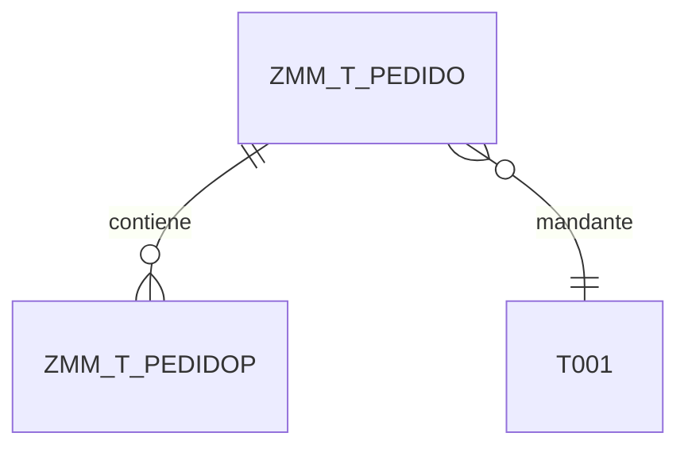

# ABAP Data Modeler

Genera modelo de datos ABAP para proyectos SAP (S/4HANA / ECC).

El objetivo es describir entidades, relaciones y dominios de negocio, y dejar explícito **qué se persiste en DDIC** (tablas `Z<MOD>_T_*`) y **qué se expone vía CDS/RAP** (Root View `Z<MOD>_R_*`, Projection View `Z<MOD>_C_*`, Service Definition `Z<MOD>_SV_*`, Service Binding `Z<MOD>_UI_*`/`Z<MOD>_API_*`), sin entrar en detalles de implementación ABAP.

## Prerrequisitos

Imprescindibles:
- `analisis/03_requerimientos_funcionales.md` - RFs con entidades implícitas
- `analisis/10_interfaces_usuario.md` - Pantallas con campos/datos

Recomendados:
- `analisis/05_historias_usuario.md` - HUs con datos manejados
- `analisis/06_casos_uso.md` - Secuencias útiles para atributos/relaciones
- `analisis/07_diagramas_procesos.md` - Procesos para entidades de histórico/auditoría
- `analisis/08_integraciones.md` - Sistemas fuente/destino para marcar "origen" de maestros
- `analisis/14_matriz_trazabilidad.md` - Relación RF-HU-Pantalla (referencia)
- Catálogo de objetos ABAP existentes (si aplica migración/extensión)

## Estructura de Salida

Generar `design/02_abap_data_model.md` con:

### 1. Catálogo de Entidades

| Entidad | Tabla DDIC | Descripción | Paquete/Área |
|---------|------------|-------------|--------------|
| Pedido | ZMM_T_PEDIDO | Cabecera de pedido personalizado | MM |
| PedidoPos | ZMM_T_PEDIDOP | Posiciones de pedido | MM |

### 2. Detalle por Entidad

Para cada entidad:

```markdown
### [NombreEntidad]

**Descripción:** Breve descripción funcional

**Tabla DDIC:** `Z<MOD>_T_<NOMBRE>` (tabla transparente)

**Persistencia (alto nivel):**
- PK: (campo(s) clave)
- FKs: (tablas de comprobación / relaciones)
- Índices secundarios: (si aplica)
- Delivery class: `A` (datos aplicación) | `C` (customizing) | `L` (temporal) | `E` (control de sistema)

**Origen del dato:** `manual` | `sync-idoc` | `sync-bapi` | `derivado` | `externo-no-persistido`

**Atributos:**
| Campo | Tipo DDIC / Dominio | Descripción | Clave | Requerido |
|-------|---------------------|-------------|-------|-----------|
| MANDT | MANDT | Mandante | Sí | Sí |
| ZPEDBEZ | ZMM_D_PEDBEZ | Número de pedido | Sí | Sí |
| ERDAT | ERDAT | Fecha de creación | No | Sí |
| ERNAM | ERNAM | Creado por | No | Sí |

**Dominios / Data Elements propuestos:**
- `ZMM_D_PEDBEZ` → tipo `CHAR(10)`, reutilizable en otras entidades.
- Si no aplica: escribir `- Ninguno`.

**CDS / RAP asociados:**
- `Z<MOD>_R_<NOMBRE>` (Root CDS View) — SELECT sobre la tabla, campos base y asociaciones
- `Z<MOD>_C_<NOMBRE>` (Projection CDS View) — expone campos para UI, anotaciones `@UI`
- `Z<MOD>_BP_<NOMBRE>` (Behavior Implementation) — clase con lógica CRUD/validaciones/acciones
- `Z<MOD>_SV_<NOMBRE>` (Service Definition) — expone entidades del servicio OData V4
- `Z<MOD>_UI_<NOMBRE>_O4` (Service Binding UI) / `Z<MOD>_API_<NOMBRE>` (API) — publicación
- Si no aplica RAP: escribir `- Ninguno`.
```

### 3. Diagrama Entidad-Relación



### 4. Matriz de Relaciones

| Entidad Origen | Relación | Entidad Destino | Cardinalidad | Tipo FK |
|----------------|----------|-----------------|--------------|---------|
| ZMM_T_PEDIDOP | pertenece a | ZMM_T_PEDIDO | N:1 | FK DDIC |
| ZMM_T_PEDIDO | referencia | T001 | N:1 | FK DDIC |

### 5. Dependencias entre Paquetes/Capas

Analizar dependencias para determinar orden de implementación:

| Objeto | Prefijo | Depende de | Requerido por | Orden |
|--------|---------|------------|---------------|-------|
| Dominios / Data elements | `Z<MOD>_D_*` / `Z<MOD>_DE_*` | — | Todas las tablas | 01 |
| Tablas maestras | `Z<MOD>_T_` | Dominios | Tablas de movimiento | 02 |
| Tablas de movimiento | `Z<MOD>_T_` | Tablas maestras | CDS Root Views | 03 |
| CDS Root Views | `Z<MOD>_R_` | Tablas DDIC | Projection Views, BDEF | 04 |
| CDS Projection Views | `Z<MOD>_C_` | Root Views | BDEF Projection, Service Def | 05 |
| Behavior Definition (BDEF) | (= Root View) | Root + Projection Views | Behavior Impl | 06 |
| Behavior Implementation | `Z<MOD>_BP_` | BDEF | Service Definition | 07 |
| Service Definition | `Z<MOD>_SV_` | Projection Views | Service Binding | 08 |
| Service Binding UI / API | `Z<MOD>_UI_` / `Z<MOD>_API_` | Service Definition | Publicación OData V4 | 09 |

**Criterios para determinar dependencias:**
- Dominio/Data element referenciado → debe existir antes que la tabla
- Tabla con FK a otra → la tabla referenciada va primero
- CDS view sobre tabla → la tabla va primero
- Vistas de consumo → siempre después de las interface views
- En caso de dependencias circulares, agrupar objetos como una unidad de transporte conjunta

### 6. Resumen de Dominios y Enums (Fixed Values)

Tabla consolidada de dominios propuestos y sus valores fijos (si aplica):

| Dominio | Tipo base | Valores fijos / Fixed Values |
|---------|-----------|------------------------------|
| ZMM_D_ESTADOPED | CHAR(2) | 01=Pendiente, 02=En proceso, 03=Cerrado |
| ZMM_D_PEDBEZ | CHAR(10) | — |

**Convenciones de nombres** (coherentes con `abap-code-generator`):

| Tipo de objeto | Patrón | Ejemplo |
|----------------|--------|---------|
| Tabla DDIC | `Z<MOD>_T_<NOMBRE>` | `ZMM_T_PEDIDO` |
| Dominio | `Z<MOD>_D_<NOMBRE>` | `ZMM_D_ESTADOPED` |
| Data Element | `Z<MOD>_DE_<NOMBRE>` | `ZMM_DE_PEDBEZ` |
| CDS Root View | `Z<MOD>_R_<NOMBRE>` | `ZMM_R_Pedido` |
| CDS Projection View | `Z<MOD>_C_<NOMBRE>` | `ZMM_C_Pedido` |
| Behavior Implementation | `Z<MOD>_BP_<NOMBRE>` | `ZMM_BP_Pedido` |
| Service Definition | `Z<MOD>_SV_<NOMBRE>` | `ZMM_SV_PedidoUI` |
| Service Binding UI | `Z<MOD>_UI_<NOMBRE>_O4` | `ZMM_UI_PEDIDO_O4` |
| Service Binding API | `Z<MOD>_API_<NOMBRE>` | `ZMM_API_PEDIDO` |
| Clase ABAP | `ZCL_<MOD>_<NOMBRE>` | `ZCL_MM_PedidoHelper` |
| Interfaz ABAP | `ZIF_<MOD>_<NOMBRE>` | `ZIF_MM_IPedido` |
| Excepción ABAP | `ZCX_<MOD>_<NOMBRE>` | `ZCX_MM_PedidoError` |

> El segmento `<MOD>` es el área funcional en mayúsculas (p. ej. `MM`, `SD`, `HR`). Garantiza coherencia con los objetos generados por `abap-code-generator` y con el flujo de activación de `cds-rap.md`.

**Reglas adicionales:**
- Campos clave: `MANDT` siempre primero en tablas cliente-dependientes.
- Dominio reutilizable: crear `Z<MOD>_D_*` cuando más de una tabla del mismo módulo usa el mismo tipo semántico.
- Fechas: `DATS` (fecha) / `TIMS` (hora) / `TIMESTAMP` (timestamp UTC).
- Importes: `CURR` + campo de moneda (`CUKY`).
- Cantidades: `QUAN` + campo de unidad (`UNIT`).
- Campos de auditoría estándar: `ERDAT`, `ERNAM`, `AEDAT`, `AENAM`.
- Longitud máxima de nombre de objeto DDIC: 16 caracteres (incluido prefijo Z).

## Proceso

1. Leer RFs e identificar sustantivos clave (entidades/tablas)
2. Analizar pantallas para extraer campos y tipos DDIC apropiados
3. Inferir relaciones (FKs) de las HUs y flujos de proceso
4. Proponer dominios/data elements reutilizables
5. Diseñar capas CDS/RAP necesarias (`Z<MOD>_R_*` Root View, `Z<MOD>_C_*` Projection View, `Z<MOD>_BP_*` si hay lógica CRUD)
6. Generar diagrama ER
7. Analizar dependencias entre objetos (orden de creación/transporte)
8. Consolidar dominios y sus fixed values (lista única, sin duplicados)
9. Guardar `design/02_abap_data_model.md`

## Restricciones

- NO generar código ABAP fuente (DDL, clases, BAPIs) — usar `abap-code-generator` para eso
- NO generar sentencias SQL/DDL completas
- Atributos descriptivos con tipo DDIC, no de programación
- Cardinalidades claras (1:1, 1:N, N:M)
- No mezclar objetos estándar SAP con custom sin justificación
- Respetar siempre el patrón `Z<MOD>_T_` para tablas y `Z<MOD>_R_`/`Z<MOD>_C_` para CDS según `cds-rap.md`

## Escritura Incremental (Documentos Extensos)

**CRÍTICO**: Para evitar errores de límite de output, generar archivo de forma INCREMENTAL:

### Proceso de Escritura

1. **Crear archivo** con encabezado y sección 1:
   ```markdown
   # Modelo de Datos ABAP

   ## 1. Catálogo de Entidades

   | Entidad | Tabla DDIC | Descripción | Paquete/Área |
   |---------|------------|-------------|--------------|
   ```

2. **Agregar entidades al catálogo** usando `replace_string_in_file`:
   - Insertar filas en la tabla del catálogo
   - Máximo 10 entidades por operación

3. **Agregar detalle de cada entidad** (append al final):
   - Escribir 3-5 entidades a la vez con sus atributos completos
   - Append siguiente bloque hasta completar todas
   - **NO acumular todo en memoria**

4. **Agregar diagrama ER** al final:
   - Append sección 3 con diagrama Mermaid completo

5. **Agregar matriz de relaciones** al final:
   - Append sección 4 con tabla de relaciones y tipo de FK

6. **Agregar dependencias entre paquetes/capas** al final:
   - Append sección 5 con tabla de dependencias y orden de implementación

7. **Agregar resumen de dominios, elementos de datos y enums** al final:
   - Append sección 6 con tabla de dominios (Dominio, Elementos de datos, Tipo base, Valores fijos)
   - Incluir únicamente elementos de datos referenciados en las entidades
   - Crear siempre dominios para los elementos de datos nuevos
   - Evitar duplicados: mismo dominio debe aparecer una sola vez

### Patrón de Append

```markdown
## 2. Detalle por Entidad

### Pedido

**Descripción:** Cabecera de pedido personalizado

**Tabla DDIC:** `ZMM_T_PEDIDO`

**Atributos:**
...

### PedidoPos

**Descripción:** Posiciones de pedido

**Tabla DDIC:** `ZMM_T_PEDIDOP`

**Atributos:**
...
```

Luego append siguiente bloque de entidades hasta completar todas.