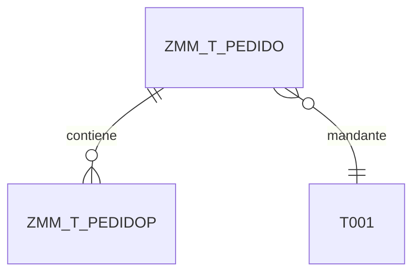

# ABAP Data Modeler

Genera el modelo de datos ABAP para proyectos SAP (S/4HANA / ECC). El objetivo es describir entidades, relaciones y dominios de negocio, y dejar explícito **qué se persiste en DDIC** (tablas `Z<MOD>_T_*`) y **qué se expone vía CDS/RAP** (`Z<MOD>_R_*`, `Z<MOD>_C_*`, `Z<MOD>_SV_*`, `Z<MOD>_UI_*`/`Z<MOD>_API_*`), sin entrar en detalles de implementación ABAP.

## Prerrequisitos

**Imprescindibles:**
- `analisis/03_requerimientos_funcionales.md` — RFs con entidades implícitas
- `analisis/10_interfaces_usuario.md` — Pantallas con campos y datos

**Recomendados:**
- `analisis/05_historias_usuario.md` — HUs con datos manejados
- `analisis/06_casos_uso.md` — Secuencias útiles para atributos/relaciones
- `analisis/07_diagramas_procesos.md` — Procesos para entidades de histórico/auditoría
- `analisis/08_integraciones.md` — Sistemas fuente/destino para marcar origen de maestros
- `analisis/14_matriz_trazabilidad.md` — Relación RF-HU-Pantalla (referencia)
- Catálogo de objetos ABAP existentes (si aplica migración/extensión)

## Proceso

1. Leer RFs e identificar sustantivos clave (entidades candidatas).
2. **[OBLIGATORIO]** Para cada entidad: ejecutar búsqueda de objetos estándar SAP (ver [Metodología Standard-First](#metodología-standard-first)).
3. **[OBLIGATORIO]** Documentar resultados en secciones 0.1 y 0.2 del archivo de salida.
4. **[OBLIGATORIO]** Solo si existe justificación documentada: proponer tabla Z.
5. Analizar pantallas para extraer campos y tipos DDIC apropiados.
6. Inferir relaciones (FKs) de las HUs y flujos de proceso.
7. Proponer dominios/data elements reutilizables (preferir dominios estándar SAP cuando aplique).
8. Diseñar capas CDS/RAP necesarias (verificar primero si existen CDS Views estándar extensibles).
9. Generar diagrama ER.
10. Analizar dependencias entre objetos (orden de creación/transporte).
11. Consolidar dominios y sus fixed values (lista única, sin duplicados).
12. Guardar `design/02_abap_data_model.md` de forma incremental.

## ⛔ REGLA ABSOLUTA: Standard-First

**PROHIBIDO proponer cualquier tabla Z sin PRIMERO ejecutar las herramientas de búsqueda.**

### Mindset

> **"SAP ya hizo esto antes que nosotros. Mi trabajo es ENCONTRAR el objeto estándar, no inventar uno nuevo."**

SAP tiene 30+ años de desarrollo con miles de procesos empresariales cubiertos:

| Dominio | Tablas / Objetos típicos |
|---------|--------------------------|
| Facturas de proveedor | RBKP, RSEG, I_SupplierInvoice, A_SupplierInvoice |
| Órdenes de compra | EKKO, EKPO, I_PurchaseOrder, A_PurchaseOrder |
| Clientes | KNA1, I_Customer, A_Customer |
| Materiales | MARA, MAKT, I_Product, A_Product |
| Workflow / Estados | SWWWIHEAD, SWWLOGHIST, JEST, TJ02 |
| Staging / IDocs | EDIDC, EDID4, BAPIRET2 |

### Prohibido

- ❌ **"No existe objeto estándar para esto"** → NO VÁLIDO sin evidencia de búsqueda.
- ❌ **"Esto es pre-ERP / portal custom"** → NO VÁLIDO. SAP cubre workflow, draft, staging, etc.
- ❌ **"La tabla estándar no tiene este campo"** → Solo válido si se muestra `abap_gettable('<TABLA>')`.
- ❌ **"No hay API para este proceso"** → NO VÁLIDO sin búsqueda en MCP docs y sistema.
- ❌ Crear tabla Z equivalente a tabla estándar existente.

### Obligatorio

1. Ejecutar herramientas `abap_*` y MCP **antes** de proponer tabla Z.
2. Si encuentras objeto estándar → **usarlo**, no crear Z equivalente.
3. Si NO encuentras objeto estándar → **demostrar** con evidencia de búsqueda.
4. Documentar resultados en secciones 0.1 y 0.2 del documento de salida.

## Metodología Standard-First

Para cada entidad identificada, ejecutar la búsqueda en **dos fases** y documentar los resultados antes de proponer cualquier objeto Z.

### Fase 1: Búsqueda en Documentación SAP (MCP)

**Siempre primero.** Usar herramientas MCP para obtener documentación oficial de objetos estándar.

**Herramientas disponibles:**

| Herramienta | Uso |
|-------------|-----|
| `mcp_mcp-sap-docs_search` | Búsqueda general por concepto |
| `mcp_mcp-sap-docs_sap_search_objects` | Buscar objetos por tipo |
| `mcp_mcp-sap-docs_sap_get_object_details` | Detalles de un objeto concreto |
| `mcp_mcp-abap_search` | Buscar en SAP Community y docs ABAP |

**Patrón de búsqueda genérico:**

```bash
# 1.1 Búsqueda por concepto de negocio
mcp_mcp-sap-docs_search: "<concepto_negocio> SAP table"
mcp_mcp-sap-docs_search: "<concepto_negocio> CDS view"
mcp_mcp-sap-docs_search: "<concepto_negocio> API OData"

# 1.2 Búsqueda por tipo de objeto — ORDEN DE PRIORIDAD OBLIGATORIO
# Paso A: API OData estándar (prioridad máxima; si existe, NO se busca BAPI)
mcp_mcp-sap-docs_sap_search_objects: "<ConceptoNegocio>", type: "ODATA_SERVICE"
mcp_mcp-sap-docs_sap_search_objects: "<ConceptoNegocio>", type: "CDS_VIEW"
mcp_mcp-sap-docs_sap_search_objects: "<ConceptoNegocio>", type: "TABLE"
mcp_mcp-abap_search: "<concepto_negocio> API Business Hub"

# Paso B: BAPI — SOLO si el Paso A no encontró API OData que cubra el requisito
mcp_mcp-sap-docs_sap_search_objects: "<ConceptoNegocio>", type: "BAPI"
mcp_mcp-abap_search: "<concepto_negocio> BAPI"

# 1.3 Detalles de objetos encontrados
mcp_mcp-sap-docs_sap_get_object_details: "<OBJETO_ENCONTRADO>"
```

**Resultado esperado:** Lista de tablas, CDS Views, APIs y OData candidatos con referencia a documentación oficial.

> Si Fase 1 no encuentra nada → ampliar términos de búsqueda antes de continuar a Fase 2.

**Referencia rápida por dominio funcional:**

| Dominio | Términos MCP | Tablas típicas | CDS Views típicos | APIs OData típicos |
|---------|-------------|---------------|-------------------|-------------------|
| **FI** | "accounting document", "GL account", "cost center" | BKPF, BSEG, SKA1, CSKS | I_JournalEntry*, I_GLAccount*, I_CostCenter* | A_JournalEntry*, A_OperationalAcct* |
| **MM** | "purchase order", "goods receipt", "supplier invoice", "material" | EKKO, EKPO, MKPF, MSEG, RBKP, RSEG, MARA | I_PurchaseOrder*, I_SupplierInvoice*, I_Product* | A_PurchaseOrder*, A_SupplierInvoice* |
| **SD** | "sales order", "delivery", "billing", "customer" | VBAK, VBAP, LIKP, LIPS, VBRK, VBRP, KNA1 | I_SalesOrder*, I_BillingDocument*, I_Customer* | A_SalesOrder*, A_BillingDocument* |
| **PP** | "production order", "BOM", "work center" | AUFK, AFPO, STKO, STPO, CRHD | I_ProductionOrder*, I_BillOfMaterial* | A_ProductionOrder*, A_BOM* |
| **WM** | "stock", "warehouse", "material document" | MARD, MARDH, MKPF, MSEG | I_MaterialStock*, I_MaterialDocumentItem* | A_MaterialStock* |
| **HR** | "employee", "organization unit", "position" | PA0001, PA0002, HRP1000, HRP1001 | I_Employee*, I_OrganizationalUnit* | A_Employee* |
| **Workflow** | "workflow", "status", "approval" | SWWWIHEAD, SWWLOGHIST, JEST, TJ02 | I_WorkflowTask* | — |

### Fase 2: Verificación en Sistema SAP (abap_*)

**Solo después de Fase 1.** Verificar en el sistema SAP conectado que los objetos encontrados existen y se adecúan al requisito.

**Herramientas disponibles:**

| Herramienta | Uso |
|-------------|-----|
| `abap_search` | Buscar objetos por nombre/texto |
| `abap_gettable` | Estructura completa de tabla DDIC |
| `abap_getstructure` | Estructura de objetos DDIC |
| `abap_getsourcecode` | Código fuente (CDS Views) |
| `abap_gettypeinfo` | Información de tipos de datos |

**Patrón de verificación genérico:**

```bash
# 2.1 Verificar existencia en sistema
abap_search: "<tabla_encontrada_fase1>"
abap_search: "<cds_view_encontrada_fase1>"
abap_search: "<api_encontrada_fase1>"

# 2.2 Obtener estructura completa
abap_gettable: "<TABLA_ESTANDAR>"    # campos, tipos, claves
abap_getstructure: "<OBJETO_DDIC>"   # estructura completa

# 2.3 Comparar campos con requisitos
# Identificar campos existentes vs. campos que faltan

# 2.4 Buscar extensiones disponibles
abap_search: "CI_<TABLA>*"            # Append structures
abap_search: "enhancement <TABLA>"

```

**Ejemplos por tipo de entidad:**

```bash
# Maestro (ej: Customer → KNA1)
abap_gettable: "KNA1"              # KUNNR, NAME1, ORT01, LAND1...
abap_search: "CI_KNA1*"            # Append structures existentes
abap_search: "I_Customer*"         # CDS Views disponibles

# Transaccional (ej: Purchase Order → EKKO)
abap_gettable: "EKKO"              # EBELN, BUKRS, BSART, LIFNR...
abap_search: "CI_EKKO*"            # Append structures
abap_search: "I_PurchaseOrder*"    # CDS Views
abap_search: "BAPI_PO_*"           # BAPIs

# Workflow / Estado (ej: Object Status → JEST)
abap_gettable: "JEST"              # OBJNR, STAT, INACT...
abap_search: "TJ02", "TJ30"        # Definición de estados
abap_search: "SWWWIHEAD"           # Workflow headers

# Financiero (ej: Accounting → BKPF/BSEG)
abap_gettable: "BKPF"              # Cabecera documento contable
abap_gettable: "BSEG"              # Posiciones
abap_search: "I_JournalEntry*"     # CDS Views FI
```

**Resultado esperado:** Confirmación de existencia en sistema, estructura completa, campos disponibles vs. faltantes, y extensiones ya disponibles.

### Árbol de Decisión: API → BAPI → Objeto Z Custom

Aplicar tras completar Fase 1 y Fase 2.

```
1. ¿Existe API OData estándar (A_*) que cubre el requisito?
   → SÍ → Usar la API directamente. NO buscar BAPI. → sección 0.1
   → NO → continuar ↓

2. ¿Existe BAPI que cubre la funcionalidad?
   → SÍ → Crear wrapper OData:
       Solo lectura  (GET)              → Function Import SEGW / @ODataFunction RAP
       Escritura     (POST/PUT/DELETE)  → Behavior Definition con llamada interna al BAPI
       → sección 0.2, justificación "BAPI wrapping"
   → NO → continuar ↓

3. Crear objeto Z custom:
   → Solo lectura  → CDS Root View Z<MOD>_R_* (sin Behavior)
   → Con escritura → CDS Root View Z<MOD>_R_* + Behavior Definition + Service Binding
   → sección 0.2, justificación completa
```

> ⚠️ **NUNCA** llamar a un BAPI directamente como RFC remoto desde SAPUI5.
> El BAPI siempre se consume desde el backend (Behavior Implementation u OData wrapper).

### Documentar Resultados (Obligatorio)

El documento de salida DEBE incluir el resultado de búsqueda de cada entidad **antes** de cualquier tabla Z:

```markdown
### [NombreEntidad] — Resultado de Búsqueda Standard-First

**Fase 1 — Documentación MCP:**
- Búsqueda realizada: `mcp_sap_docs_search("concepto")`, `mcp_sap_search_objects("Concepto", type="TABLE")`
- Objetos encontrados: [TABLA_STD], [I_CDS_VIEW], [A_API_ODATA]

**Fase 2 — Verificación en Sistema:**
- Herramientas usadas: `abap_search("término")`, `abap_gettable("TABLA")`
- Resultado: [EXISTE / NO EXISTE en sistema]
- Estructura obtenida: [campos principales]
- Extensiones disponibles: [CI_*, append structures]

**Decisión:**
- [ ] Usar objeto estándar: [NOMBRE]             → sección 0.1
- [ ] Crear objeto Z: [NOMBRE_Z] — [justificación] → sección 0.2
```

### Criterios de Aceptación

**No se permite documentar tablas Z sin:**
1. Haber ejecutado al menos 3 búsquedas por entidad (Fase 1 + Fase 2).
2. Haber documentado secciones 0.1 y 0.2 con evidencia explícita.
3. Haber descartado con evidencia el uso de objeto estándar.

**Búsquedas insuficientes (no válidas):**
- ❌ "No se encontraron objetos estándar" (sin especificar qué se buscó)
- ❌ "Se revisó la documentación SAP" (sin herramientas usadas)
- ❌ "MARA no cubre los requisitos" (sin resultado de `abap_gettable`)

**Búsquedas suficientes (válidas):**
- ✅ `abap_search('supplier invoice')` → encontró I_SupplierInvoice; no cubre campo custom Z_WORKFLOW_STATUS
- ✅ `abap_gettable('RBKP')` → estructura con BELNR, GJAHR, BLDAT; falta Z_APPROVAL_DATE requerido por RF-045
- ✅ `sap_search_objects('Customer', type='CDS_VIEW')` → encontró I_Customer; no incluye scoring custom requerido

### Errores Comunes y Cómo Evitarlos

#### ERROR #1: "No hay tabla estándar para este proceso"

**Argumento tipo:** "Este proceso es específico del negocio/portal custom, necesito crear Zxxx."

**Por qué está mal:** SAP tiene tablas de workflow, draft, staging y log para casi todo proceso empresarial.

**Búsquedas obligatorias antes de crear tabla Z:**

```bash
# Fase 1 MCP
mcp_sap_docs_search: "<concepto_negocio> SAP table"
mcp_sap_search_objects: "<ConceptoNegocio>", type: "TABLE"
mcp_sap_search_objects: "<ConceptoNegocio>", type: "CDS_VIEW"

# Fase 2 abap_*
abap_search: "<concepto>", "<proceso_similar>"
abap_search: "workflow", "draft", "staging"
abap_search: "JEST"
abap_gettable: "<TABLA_CANDIDATA>"
```

**Alternativas a verificar:** proceso estándar similar, draft/parked documents, workflow SAP (SWWWIHEAD), custom fields vía append (CI_*), RAP Draft tables.

**Justificación válida:**
> ✅ `mcp_sap_search_objects('<Entidad>', TABLE)` → no encontró tabla específica. `abap_gettable('<TABLA_STD>')` → estructura con A, B, C. No incluye D, E, F requeridos por RF-XXX. Evaluado CI_<TABLA_STD> pero requiere 15+ campos con lógica compleja. Se crea ZTLM_<ENTIDAD>_EXT con FK a <TABLA_STD>.

---

#### ERROR #2: "Sistema externo necesita tabla Z de staging"

**Argumento tipo:** "Los datos de un sistema externo/portal necesitan validarse antes de integrarse en SAP."

**Por qué está mal:** SAP tiene IDocs (EDIDC, EDID4), Application Log (BAL), BAPIRET2 y BAPIs con flujo borrador→validación→contabilización.

**Búsquedas obligatorias:**

```bash
# Fase 1 MCP
mcp_sap_search: "IDOC <tipo_documento>"
mcp_sap_search: "BAPI <proceso> staging"
mcp_sap_search: "Application Log SAP"

# Fase 2 abap_*
abap_search: "EDIDC", "EDID4"
abap_search: "BAPI_<PROCESO>_PARK", "BAPI_<PROCESO>_PRELIM"
abap_search: "BAL_LOG", "application log"
abap_gettable: "BAPIRET2"
```

**Alternativas a verificar:** IDocs (EDIDC/EDID4), BAPI_*_PARK/PRELIM, Application Log (BAL), BAPIRET2, extensión de tabla transaccional con metadatos de integración.

**Justificación válida:**
> ✅ `mcp_sap_search('IDOC PurchaseOrder')` → sistema usa IDocs. `abap_gettable('EDIDC')` → no tiene VALIDATION_SCORE, MATCHED_RULES, ATTACHMENT_URLS requeridos. Se crea ZTLM_INT_STAGING con esos campos, FK a EDIDC una vez creado el IDoc.

---

#### ERROR #3: "No hay API OData ni BAPI para este proceso"

**Argumento tipo:** "No hay servicio OData ni BAPI estándar, necesito tabla Z + RAP custom."

**Por qué está mal:** SAP API Business Hub tiene 1000+ APIs. Si no hay API, casi siempre hay un BAPI que puede exponerse como wrapper OData. La tabla Z custom es el último recurso.

**Búsquedas obligatorias (en orden estricto):**

```bash
# Fase 1 — Paso A: API OData (buscar SIEMPRE antes que BAPI)
mcp_sap_search: "<proceso> API Business Hub"
mcp_sap_search_objects: "<Proceso>", type: "ODATA_SERVICE"
mcp_sap_get_object_details: "A_<Entidad>"
mcp_abap_search: "<proceso> standard API OData"

# Fase 1 — Paso B: BAPI (solo si el Paso A no encontró API OData)
mcp_sap_search_objects: "<Proceso>", type: "BAPI"
mcp_abap_search: "<proceso> BAPI"

# Fase 2 — Verificar en sistema
abap_search: "A_<Entidad>*"              # APIs OData estándar (primero)
abap_search: "I_<Entidad>*"              # CDS Views estándar (para RAP)
abap_search: "BAPI_<PROCESO>*"           # BAPIs (solo si no hay API)
abap_getsourcecode: "BAPI_<NAME>"        # Ver parámetros y operaciones
```

**Estrategia por resultado:**

| Resultado búsqueda | Acción |
|--------------------|--------|
| Existe API OData `A_*` que cubre el requisito | Usar la API. No crear nada. |
| No hay API, pero existe BAPI — solo lectura | Wrapper OData: Function Import SEGW / `@ODataFunction` RAP |
| No hay API, pero existe BAPI — con escritura (POST) | Behavior Definition con llamada interna al BAPI |
| No hay API ni BAPI | Crear CDS View Z + Behavior Definition (si escritura) |

**Justificación válida (sin API, con BAPI):**
> ✅ `mcp_sap_search_objects('<Entidad>', ODATA_SERVICE)` → no encontró API OData que cubra la operación X. `abap_search('BAPI_<PROCESO>*')` → encontró BAPI_<NAME>. `abap_getsourcecode('BAPI_<NAME>')` → soporta CREATE/CHANGE con parámetros A, B, C. Se crea wrapper OData con Behavior Definition que llama al BAPI internamente.

**Justificación válida (sin API ni BAPI):**
> ✅ `mcp_sap_search_objects('<Entidad>', ODATA_SERVICE)` → no encontró API OData. `mcp_sap_search_objects('<Entidad>', BAPI)` → no encontró BAPI específico. `abap_search('BAPI_<PROCESO>*')` → BAPIs encontrados no cubren operación X (ver parámetros en abap_getsourcecode). Se crea objeto Z custom con CDS Root View + Behavior Definition.

---

#### ERROR #4: "Tabla estándar no tiene un campo, creo tabla Z completa"

**Argumento tipo:** "La tabla estándar no tiene el campo X, necesito tabla Z completa."

**Por qué está mal:** SAP permite append structures (CI_*) sin modificar la tabla; crear tabla Z completa duplica datos y rompe integridad referencial.

**Búsquedas obligatorias:**

```bash
# Fase 1 MCP
mcp_sap_search: "<TABLA_STD> extension SAP"
mcp_sap_search: "append structure SAP"

# Fase 2 abap_*
abap_gettable: "<TABLA_STD>"
abap_search: "CI_<TABLA_STD>*"
abap_search: "enhancement <TABLA_STD>"
abap_search: "BADI <proceso>"
```

**Alternativas a verificar:** Append Structure CI_<TABLA>ZZ, Extension Include reservado, tabla Z extensión solo con campos custom (FK a tabla estándar), BADI/BTE para lógica.

**Justificación válida:**
> ✅ `abap_gettable('<TABLA_STD>')` → 150+ campos disponibles. `abap_search('CI_<TABLA_STD>*')` → no existe append. Tabla es cliente-independiente y RF-XXX requiere datos multi-mandante + 25 campos custom con relaciones M:N. Se crea ZTLM_<ENTIDAD>_EXT sin duplicar campos de <TABLA_STD>, FK obligatorio.

---

#### ERROR #5: "La tabla estándar es de otro módulo"

**Argumento tipo:** "La tabla TABLA_FI es de módulo FI, mi desarrollo es MM/SD, necesito tabla Z del módulo correcto."

**Por qué está mal:** La integración cross-módulo es el diseño deliberado de SAP (MM→FI, SD→FI, PP→MM). Duplicar datos cross-módulo crea inconsistencias.

**Búsquedas obligatorias:**

```bash
# Fase 1 MCP
mcp_sap_search: "<Proceso1> <Proceso2> integration SAP"
mcp_sap_search: "cross-module <módulo1> <módulo2>"

# Fase 2 abap_*
abap_gettable: "<TABLA_OTRO_MODULO>"
abap_search: "I_<Entidad>*"            # CDS Views cross-módulo
```

**Alternativas a verificar:** usar tabla del otro módulo directamente (diseño SAP), CDS View cross-módulo (I_* ya une MM+FI, etc.), tabla Z solo para campos custom sin duplicar datos.

**Justificación válida:**
> ✅ `abap_search('I_<Similar>*')` → no existe CDS View cross-módulo. RF-XXX requiere JOIN de 5+ tablas de 3 módulos con 10+ campos calculados en tiempo real. Evaluado CDS View custom pero campos son persistentes (no calculados). Se crea tabla Z materializada con job de sincronización nocturna.

---

**Regla de Oro:**

> 🔹 **Fase 1 (MCP docs) → Fase 2 (abap_* verificación) → Justificación con evidencia → Decisión**
> 🔹 NO crear tabla Z si existe tabla estándar + append/extension
> 🔹 NO crear tabla Z si CDS View + RAP cubre el requisito
> 🔹 NO asumir nada — siempre demostrar con herramientas

## Estructura de Salida

Generar `design/02_abap_data_model.md` con las siguientes secciones.

### Sección 0: Análisis de Objetos Estándar SAP

#### 0.1 Objetos Estándar Reutilizados

| Objeto | Tipo | Funcionalidad | Herramienta MCP | Herramienta abap_* | Resultado |
|--------|------|---------------|-----------------|--------------------|-----------|
| LFA1 | Tabla | Datos maestros proveedores | sap_search_objects("Supplier", TABLE) | abap_gettable("LFA1") | Estructura con LIFNR, NAME1, ORT01, LAND1 |
| I_Supplier | CDS View | Vista de proveedores | sap_search_objects("Supplier", CDS_VIEW) | abap_search("I_Supplier*") | CDS existente con asociaciones |

> Si no hay objetos reutilizables: indicar "No se identificaron objetos estándar reutilizables."
> Si existe tabla estándar pero no CDS View: indicar que se usará la tabla y se creará CDS View propia.

#### 0.2 Objetos Z Justificados

| Objeto Z | Entidad Funcional | Búsqueda Realizada | Herramientas Usadas | Resultados | Justificación |
|----------|-------------------|-------------------|---------------------|------------|---------------|
| ZTLM_T_PEDIDO | Pedidos custom | "purchase order", "EKKO", "Z*PO*" | abap_search, abap_gettable | EKKO no tiene campos Z_CUSTOM_APPROVAL | Campos específicos del cliente |

### Sección 1: Catálogo de Entidades

| Entidad | Tabla DDIC / Objeto Estándar | Descripción | Paquete/Área | Tipo |
|---------|------------------------------|-------------|--------------|------|
| Proveedor | LFA1 (estándar) | Datos maestros de proveedores | MM | Estándar SAP |
| Pedido | ZMM_T_PEDIDO (custom) | Cabecera de pedido personalizado | MM | Custom Z |
| PedidoPos | ZMM_T_PEDIDOP (custom) | Posiciones de pedido | MM | Custom Z |

### Sección 2: Detalle por Entidad

Plantilla para cada entidad:

```markdown
### [NombreEntidad]

**Descripción:** Breve descripción funcional

**Tabla DDIC:** `Z<MOD>_T_<NOMBRE>` (tabla transparente)

**Persistencia:**
- PK: (campo(s) clave)
- FKs: (tablas de comprobación / relaciones)
- Índices secundarios: (si aplica)
- Delivery class: `A` (datos aplicación) | `C` (customizing) | `L` (temporal) | `E` (control)

**Origen del dato:** `manual` | `sync-idoc` | `sync-bapi` | `derivado` | `externo-no-persistido`

**Atributos:**
| Campo | Tipo DDIC / Dominio | Descripción | Clave | Requerido |
|-------|---------------------|-------------|-------|-----------|
| MANDT | MANDT | Mandante | Sí | Sí |
| ZPEDBEZ | ZMM_D_PEDBEZ | Número de pedido | Sí | Sí |
| ERDAT | ERDAT | Fecha de creación | No | Sí |
| ERNAM | ERNAM | Creado por | No | Sí |

**Dominios / Data Elements propuestos:**
- `ZMM_D_PEDBEZ` → tipo `CHAR(10)`, reutilizable en otras entidades.
- Si no aplica: `- Ninguno`.

**CDS / RAP asociados:**
- `Z<MOD>_R_<NOMBRE>` — Root CDS View (SELECT sobre tabla, campos base, asociaciones)
- `Z<MOD>_C_<NOMBRE>` — Projection View (campos para UI, anotaciones @UI)
- `Z<MOD>_BP_<NOMBRE>` — Behavior Implementation (CRUD / validaciones / acciones)
- `Z<MOD>_SV_<NOMBRE>` — Service Definition (expone entidades OData V4)
- `Z<MOD>_UI_<NOMBRE>_O4` — Service Binding UI / `Z<MOD>_API_<NOMBRE>` — API
- Si no aplica RAP: `- Ninguno`.
```

### Sección 3: Diagrama Entidad-Relación



### Sección 4: Matriz de Relaciones

| Entidad Origen | Relación | Entidad Destino | Cardinalidad | Tipo FK |
|----------------|----------|-----------------|--------------|---------|
| ZMM_T_PEDIDOP | pertenece a | ZMM_T_PEDIDO | N:1 | FK DDIC |
| ZMM_T_PEDIDO | referencia | T001 | N:1 | FK DDIC |

### Sección 5: Dependencias entre Capas

Determina el orden de creación/transporte de objetos.

| Capa | Patrón | Depende de | Requerido por | Orden |
|--------|---------|------------|---------------|-------|
| Dominios / Data Elements | `Z<MOD>_D_*` / `Z<MOD>_DE_*` | — | Todas las tablas | 01 |
| Tablas maestras | `Z<MOD>_T_` | Dominios | Tablas de movimiento | 02 |
| Tablas de movimiento | `Z<MOD>_T_` | Tablas maestras | CDS Root Views | 03 |
| CDS Root Views | `Z<MOD>_R_` | Tablas DDIC | Projection Views, BDEF | 04 |
| CDS Projection Views | `Z<MOD>_C_` | Root Views | BDEF Projection, Service Def | 05 |
| Behavior Definition (BDEF) | (= Root View) | Root + Projection Views | Behavior Impl | 06 |
| Behavior Implementation | `Z<MOD>_BP_` | BDEF | Service Definition | 07 |
| Service Definition | `Z<MOD>_SV_` | Projection Views | Service Binding | 08 |
| Service Binding UI / API | `Z<MOD>_UI_` / `Z<MOD>_API_` | Service Definition | Publicación OData V4 | 09 |

> En caso de dependencias circulares, agrupar como unidad de transporte conjunta.

### Sección 6: Dominios, Data Elements y Enums

Tabla consolidada de dominios propuestos con sus valores fijos.

| Dominio | Data Element | Tipo base | Valores fijos |
|---------|-------------|-----------|---------------|
| ZMM_D_ESTADOPED | ZMM_DE_ESTADOPED | CHAR(2) | 01=Pendiente, 02=En proceso, 03=Cerrado |
| ZMM_D_PEDBEZ | ZMM_DE_PEDBEZ | CHAR(10) | — |

**Convenciones de nombres (objetos custom Z):**

| Tipo de objeto | Patrón | Ejemplo |
|----------------|--------|---------|
| Tabla DDIC | `Z<MOD>_T_<NOMBRE>` | `ZMM_T_PEDIDO` |
| Dominio | `Z<MOD>_D_<NOMBRE>` | `ZMM_D_ESTADOPED` |
| Data Element | `Z<MOD>_DE_<NOMBRE>` | `ZMM_DE_PEDBEZ` |
| CDS Root View | `Z<MOD>_R_<NOMBRE>` | `ZMM_R_Pedido` |
| CDS Projection View | `Z<MOD>_C_<NOMBRE>` | `ZMM_C_Pedido` |
| Behavior Implementation | `Z<MOD>_BP_<NOMBRE>` | `ZMM_BP_Pedido` |
| Service Definition | `Z<MOD>_SV_<NOMBRE>` | `ZMM_SV_PedidoUI` |
| Service Binding UI | `Z<MOD>_UI_<NOMBRE>_O4` | `ZMM_UI_PEDIDO_O4` |
| Service Binding API | `Z<MOD>_API_<NOMBRE>` | `ZMM_API_PEDIDO` |
| Clase ABAP | `ZCL_<MOD>_<NOMBRE>` | `ZCL_MM_PedidoHelper` |
| Interfaz ABAP | `ZIF_<MOD>_<NOMBRE>` | `ZIF_MM_IPedido` |
| Excepción ABAP | `ZCX_<MOD>_<NOMBRE>` | `ZCX_MM_PedidoError` |

> `<MOD>` = área funcional en mayúsculas (MM, SD, HR…). Garantiza coherencia con `abap-code-generator` y el flujo de `cds-rap.md`.

**Reglas DDIC:**
- `MANDT` siempre primer campo en tablas cliente-dependientes.
- Crear `Z<MOD>_D_*` cuando más de una tabla del mismo módulo usa el mismo tipo semántico.
- Fechas: `DATS` / `TIMS` / `TIMESTAMP` (UTC).
- Importes: `CURR` + campo de moneda (`CUKY`).
- Cantidades: `QUAN` + campo de unidad (`UNIT`).
- Campos de auditoría estándar: `ERDAT`, `ERNAM`, `AEDAT`, `AENAM`.
- Longitud máxima de nombre de objeto DDIC: **16 caracteres** (incluido prefijo Z).


## Restricciones

- **Standard-First:** No proponer tabla Z sin evidencia documentada de búsqueda (secciones 0.1 y 0.2 obligatorias).
- **Solo diseño:** No generar código ABAP fuente (DDL, clases, BAPIs) — usar `abap-code-generator`.
- **Sin SQL/DDL:** No generar sentencias SQL o DDL completas.
- **Evidencia explícita:** No justificar objetos Z con frases genéricas ("requisitos específicos") sin búsqueda documentada.
- **Tipos DDIC:** Atributos con tipo DDIC (no tipos de programación).
- **Cardinalidades:** Siempre especificar claramente (1:1, 1:N, N:M).
- **Sin mezcla injustificada:** No mezclar objetos estándar con custom sin justificación documentada.
- **Patrón de nombres:** Respetar `Z<MOD>_T_` para tablas y `Z<MOD>_R_`/`Z<MOD>_C_` para CDS.
- **Dominios estándar:** Preferir dominios estándar SAP (MATNR, KUNNR, LIFNR, etc.) antes de crear dominios Z.

## Escritura Incremental

Para evitar errores de límite de output, generar el archivo de forma **incremental**. Las secciones 0.1 y 0.2 deben escribirse **siempre primero**.

**Orden obligatorio:**

1. Crear archivo con encabezado y secciones 0.1 y 0.2.
2. Agregar Sección 1 — Catálogo de Entidades (máx. 10 por operación).
3. Agregar Sección 2 — Detalle de entidades (3-5 entidades por operación).
4. Agregar Sección 3 — Diagrama ER.
5. Agregar Sección 4 — Matriz de Relaciones.
6. Agregar Sección 5 — Dependencias entre Capas.
7. Agregar Sección 6 — Dominios, Data Elements y Enums.

**Reglas:**
- Hacer append progresivo al archivo; no acumular todo en memoria.
- Sección 6: un dominio = una fila (sin duplicados).
- Incluir únicamente data elements referenciados en entidades definidas.