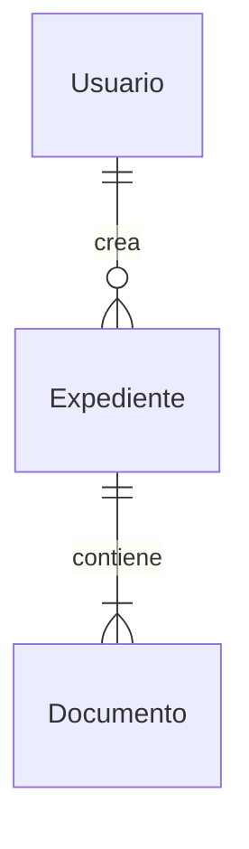

# Data Modeler

Genera modelo de datos para MVP full-stack.

El objetivo es describir entidades, relaciones y enums de negocio, y además dejar explícito **qué se persiste en base de datos** (tablas, PK/FK e índices a alto nivel) sin entrar en detalles de implementación.

## Prerrequisitos

Imprescindibles:
- `design/01_technical_design.md` - Lista canónica de módulos
- `analisis/03_requerimientos_funcionales.md` - RFs con entidades implícitas
- `analisis/10_interfaces_usuario.md` - Pantallas con campos/datos

Recomendados:
- `analisis/05_historias_usuario.md` - HUs con datos manejados
- `analisis/06_casos_uso.md` - Secuencias útiles para atributos/relaciones
- `analisis/07_diagramas_procesos.md` - Procesos (sincronizaciones/envíos) para entidades de histórico/auditoría
- `analisis/08_integraciones.md` - Sistemas fuente/destino (WordAid, SAP) para marcar “origen” de maestros
- `analisis/14_matriz_trazabilidad.md` - Relación RF-HU-Pantalla (referencia)

## Estructura de Salida

Generar `design/02_data_model.md` con:

### 1. Catálogo de Entidades

| Entidad | Descripción | Módulo |
|---------|-------------|--------|
| Usuario | Datos de usuario del sistema | gestion-usuarios |
| Expediente | Expediente de trámite | gestion-expedientes |

### 2. Detalle por Entidad

Para cada entidad:

```markdown
### [NombreEntidad]

**Descripción:** Breve descripción

**Persistencia (alto nivel):**
- Tabla: `snake_case` (si aplica)
- PK: (campo(s))
- FKs: (si aplica)
- Índices/únicos: (si aplica)

**Origen del dato:** `manual` | `sync` | `derivado` | `externo-no-persistido`

**Atributos:**
| Campo | Tipo | Descripción | Requerido |
|-------|------|-------------|-----------|
| id | string | Identificador único | Sí |
| nombre | string | Nombre completo | Sí |
| estado | enum | Estado actual | Sí |

**Enums asociados:**
- EstadoExpediente
  - Si no aplica: escribir `- Ninguno` (evitar `N/A`).

**Regla anti-redundancia (CRÍTICO):**
- En cada entidad, listar SOLO los nombres de enums usados (sin valores).
- Los valores de los enums se definen y consolidan SOLO en la sección 5 (Resumen de Enums).
```

### 3. Diagrama Entidad-Relación



### 4. Matriz de Relaciones

| Entidad Origen | Relación | Entidad Destino | Cardinalidad |
|----------------|----------|-----------------|--------------|
| Usuario | crea | Expediente | 1:N |

### 5. Dependencias entre Módulos

Analizar relaciones entre módulos para determinar orden de implementación:

| Módulo | Depende de | Requerido por | Orden |
|--------|------------|---------------|-------|
| auth | - | todos | 01 |
| catalogos | auth | expedientes, reportes | 02 |
| expedientes | auth, catalogos | documentos, reportes | 03 |
| documentos | expedientes | reportes | 04 |
| reportes | todos los anteriores | dashboard | 05 |
| dashboard | todos | - | 06 |

**Criterios para determinar dependencias:**
- Entidad que referencia a otra (FK) → la referenciada va primero
- Módulo que consume servicio de otro → el proveedor va primero
- Módulo de reporting/dashboard → siempre al final
- Módulos sin dependencias (catálogos, auth) → primero
- En caso de dependencias circulares agrupar modulos relacionados como si fueran uno solo (p.ej. auth + usuarios)

**Criterios adicionales (para coherencia documental):**
- Si un módulo define una entidad “core” (p.ej. `Embarque`), los módulos que la referencian van después.
- Si un módulo define un repositorio transversal (p.ej. documentos), debe aparecer como dependencia explícita cuando otras pantallas necesitan adjuntar/consultar documentos.


### 6. Resumen de Enums

Tabla resumen consolidando todos los enums definidos/consumidos en las entidades (valores únicos):

| Enum | Valores |
|------|---------|
| EstadoExpediente | PENDIENTE, EN_PROCESO, FINALIZADO |

**Convenciones recomendadas (mantener breve):**
- `id`: string (único) en todas las entidades.
- Fechas: usar `date` (solo fecha) y `datetime` (fecha-hora).
- Montos: usar `decimal` y referenciar `Moneda` cuando aplique.
- Campos “ref”: usar sufijo `Id` (p.ej. `embarqueId`).
- Persistencia: tablas en `snake_case`, PK `id` cuando aplique, FKs con sufijo `_id`.

## Proceso

1. Leer RFs e identificar sustantivos clave (entidades)
2. Analizar pantallas para extraer campos/atributos
3. Inferir relaciones de las HUs y flujos
4. Generar diagrama ER
5. Analizar dependencias entre módulos (entidades, servicios, flujos)
6. Consolidar enums a partir de enums referenciados en atributos y en “Enums asociados” (lista única y sin duplicados)
7. Guardar `design/02_data_model.md`

## Restricciones

- NO generar código TypeScript (interfaces)
- NO generar clases Java/JPA ni DDL SQL completo (solo mapping alto nivel)
- Atributos descriptivos, no técnicos
- Cardinalidades claras (1:1, 1:N, N:M)

## Escritura Incremental (Documentos Extensos)

**CRÍTICO**: Para evitar errores de límite de output, generar archivo de forma INCREMENTAL:

### Proceso de Escritura

1. **Crear archivo** con encabezado y sección 1:
   ```markdown
   # Modelo de Datos
   
   ## 1. Catálogo de Entidades
   
   | Entidad | Descripción | Módulo |
   |---------|-------------|--------|
   ```

2. **Agregar entidades al catálogo** usando `replace_string_in_file`:
   - Insertar filas en la tabla del catálogo
   - Máximo 10 entidades por operación

3. **Agregar detalle de cada entidad** (append al final):
   - Escribir 3-5 entidades a la vez con sus atributos completos
   - Append siguiente bloque hasta completar todas
   - **NO acumular todo en memoria**

4. **Agregar diagrama ER** al final:
   - Append sección 3 con diagrama Mermaid completo

5. **Agregar matriz de relaciones** al final:
   - Append sección 4 con tabla de relaciones

6. **Agregar dependencias entre módulos** al final:
   - Append sección 5 con tabla de dependencias y orden de implementación

7. **Agregar resumen de enums** al final:
   - Append sección 6 con una tabla de enums (Enum, Valores)
   - Incluir únicamente enums referenciados en las entidades
   - Evitar duplicados: mismo nombre de enum debe aparecer una sola vez

### Patrón de Append

```markdown
## 2. Detalle por Entidad

### Usuario

**Descripción:** Datos de usuario del sistema

**Atributos:**
...

### Expediente

**Descripción:** Expediente de trámite

**Atributos:**
...
```

Luego append siguiente bloque:
```markdown

### DocumentoAdjunto

**Descripción:** Documento vinculado a expediente

**Atributos:**
...
```

### Respuesta del Skill

**NO devolver contenido completo** del archivo. Solo confirmar:

```
Archivo design/02_data_model.md generado:
- Entidades: X
- Relaciones: Y
- Atributos totales: Z
- Enums: E
```

## Output

```
Archivo design/02_data_model.md generado:
- Entidades: X
- Relaciones: Y
- Enums: E
```
