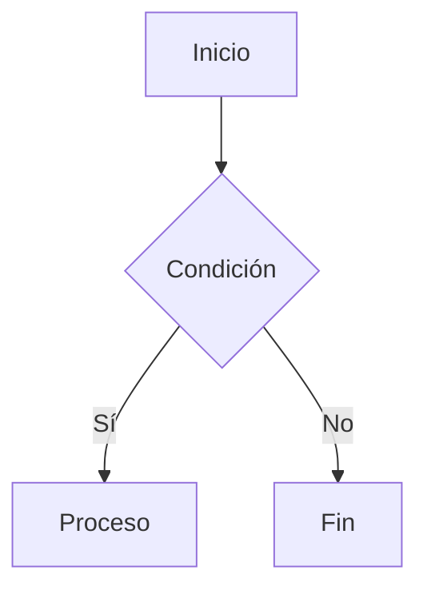

# Image Analyzer

Convierte imágenes a formatos editables usando capacidad multimodal nativa.

## Flujo de Trabajo

1. Recibir bloque de imágenes a procesar (máximo 5)
2. Para cada imagen del bloque:
   - Usar `extract_image_from_file` para obtener base64
   - Analizar visualmente con capacidad nativa de visión
   - Clasificar y convertir según tipo
3. Si es el primer bloque (1-5): Crear `imagenes.md`
4. Si es bloque posterior (6+): Hacer append a `imagenes.md` existente

**Nota**: Este skill se invoca por bloque de 5 imágenes desde el agente Requirements_Extractor.

## Clasificación y Conversión

| Tipo | Indicadores | Formato Salida |
|------|-------------|----------------|
| **Pantalla/UI** | Botones, inputs, menús, layouts | Wireframe ASCII |
| **Diagrama** | Cajas, flechas, flujos, UML | Mermaid |
| **Tabla** | Filas, columnas, celdas | Tabla Markdown |
| **Texto** | Documento escaneado | Transcripción MD |

## Formato de Salida (imagenes.md)

Para cada imagen:

```markdown
### Análisis: [nombre_archivo]

**Tipo**: [Pantalla|Diagrama|Tabla|Texto|Otro]

**Descripción**: [Descripción detallada mencionando elementos visuales específicos: colores, posiciones, iconos]

**Conversión**:
[Contenido convertido según tipo]
```

## Reglas Críticas

1. **OBLIGATORIO usar visión**: Analizar píxeles reales, NO inferir del OCR
2. **Detalles visuales**: Mencionar colores, posiciones, iconos (prueba de análisis real)
3. **No inventar**: Solo documentar lo visible en la imagen
4. **Bloques de 5**: Procesar máximo 5 imágenes por invocación
5. **Primer bloque**: Crear `imagenes.md` nuevo
6. **Bloques posteriores**: Hacer append (añadir) a `imagenes.md` existente

## Ejemplos de Conversión

### Pantalla → Wireframe ASCII

```
+----------------------------------+
|  [Logo]     Título     [Usuario] |
+----------------------------------+
|                                  |
|  Label: [_______________]        |
|  Label: [_______________]        |
|                                  |
|  [Cancelar]        [Guardar]     |
+----------------------------------+
```

### Diagrama → Mermaid



### Tabla → Markdown

| Columna 1 | Columna 2 |
|-----------|-----------|
| Valor 1   | Valor 2   |
