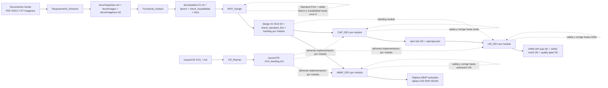

# Workflow MVP - Agentes y Skills

## 1. Alcance de esta documentacion

Este documento consolida el flujo de trabajo de los 7 agentes en `.github/agents` y detalla los skills que cada uno utiliza.

Agentes revisados:
- `.github/agents/Requirements_Extractor.agent.md`
- `.github/agents/Functional_Analyst.agent.md`
- `.github/agents/MVP_Design.agent.md`
- `.github/agents/ABAP_DEV.agent.md`
- `.github/agents/CAP_DEV.agent.md`
- `.github/agents/UI5_DEV.agent.md`
- `.github/agents/CR_Planner.md`

## 2. Mapa global de ejecucion

### 2.1 Flujo principal MVP (de requisitos a implementacion)

Stack tecnologico: **SAP UI5 (frontend) + SAP CAP Node.js/TypeScript (backend BTP) + ABAP/OData (backend S/4HANA)**.

1. `Requirements_Extractor`  
   Entrada: documentos fuente (pdf/docx/txt/imagenes).  
   Salida: `docs/requisitos.md` + carpeta `docs/images/` + `docs/imagenes.md`.

2. `Functional_Analyst`  
   Entrada: `docs/requisitos.md`, `docs/imagenes.md`.  
   Salida: carpeta `docs/analisis/` con secciones 01-14 + diagramas BPMN en `docs/analisis/bpmn/` + `Analisis_Funcional.docx`.

3. `MVP_Design`  
   Entrada: artefactos `docs/analisis/`.  
   Salida: `design/01_technical_design.md`, `design/02_abap_data_model.md`, `design/02_cap_data_model.md`, `design/02_ui5_data_model.md`, `design/03_odata_services.md`, `design/check_standard_first.md`, y `backlog/*.md` por modulo con validaciones completas.

4. `ABAP_DEV` (por modulo backlog - backend S/4HANA)  
   Entrada: `backlog/XX_modulo.md` + `design/02_abap_data_model.md` + `design/03_odata_services.md`.  
   Salida: objetos ABAP activados en sistema SAP (tablas DDIC, CDS Views, RAP/SEGW, clases).

5. `CAP_DEV` (por modulo backlog - backend BTP/CAP)  
   Entrada: `backlog/XX_modulo.md` (+ `design/02_cap_data_model.md`, `design/03_odata_services.md` opcional).  
   Salida: modulos CAP implementados + tests en verde + `openapi.json`.

6. `UI5_DEV` (por modulo backlog)  
   Entrada: `backlog/XX_modulo.md` + `openapi.json` (+ analisis opcional).  
   Salida: vistas SAP UI5 implementadas + tests OPA5 en modo real/mock + quality gate verde.

### 2.2 Flujo paralelo para cambios evolutivos (CR)

`CR_Planner` opera aparte del flujo MVP base:
- Entrada: `issues/CR-XXX_*.md` (o descripcion del usuario).
- Salida: `issues/CR-XXX_backlog.md` adaptado al codigo real del repo.
- No implementa codigo: solo genera backlog tecnico atomico y trazable.

### 2.3 Diagrama Mermaid del pipeline global



### 2.4 Explicacion narrativa del diagrama

El pipeline principal comienza en los documentos fuente y los transforma en requisitos estructurados (`docs/requisitos.md` e `docs/imagenes.md`) con `Requirements_Extractor`.  
Con esos artefactos, `Functional_Analyst` genera el analisis funcional completo (`docs/analisis/01-14`), los diagramas de proceso Mermaid, los archivos BPMN en `docs/analisis/bpmn/` y valida trazabilidad al 100% antes de pasar a diseno.

`MVP_Design` usa el analisis para construir la base tecnica SAP (`design/01`), los modelos de datos para ABAP DDIC/CDS, CAP CDS y UI5 (`design/02_*`), los contratos OData V2/V4 (`design/03_odata_services.md`), y los backlogs por modulo. Incluye una nueva fase obligatoria de **Standard-First** que valida que todos los objetos Z propuestos tienen evidencia documentada de busqueda SAP estandar antes de ser aceptados. Los backlogs pasan por 6 validaciones automaticas mas revision manual hasta error 0.

Desde los backlogs modulares se ejecuta la implementacion: `ABAP_DEV` crea y activa objetos SAP (tablas DDIC, CDS Views, RAP/SEGW); `CAP_DEV` implementa los servicios CAP Node.js con tests y genera `openapi.json`; `UI5_DEV` construye las vistas SAP UI5 pantalla por pantalla con tests OPA5 en doble modo (API real y mock) cerrando con quality gate verde.

El flujo de CR es paralelo al MVP base: `CR_Planner` recibe un `CR-XXX`, lo convierte en `issues/CR-XXX_backlog.md` adaptado al codigo existente y ese backlog alimenta directamente los agentes de implementacion, sin rehacer extraccion ni analisis completo.

## 3. Convenciones transversales detectadas

- En los agentes de diseno/implementacion existe una regla explicita: cada fase se ejecuta por subagente (`agent`), y el agente principal orquesta/valida.
- **Principio Standard-First SAP (nuevo)**: antes de proponer cualquier objeto Z (tabla, CDS View, clase, servicio), los subagentes de MVP_Design DEBEN buscar en documentacion SAP con herramientas MCP y verificar en el sistema SAP conectado. Bloqueante hasta evidencia documentada.
- Hay validaciones iterativas obligatorias hasta error 0 en:
  - diseno (`validate_design.py` + `validate_warning_justifications.py`),
  - Standard-First (`check_standard_first.md`),
  - trazabilidad de backlog por modulo y consolidada (`valida_trazabilidad.py`),
  - integridad de diseno (`valida_integridad_diseno.py`),
  - completitud funcional y HU (`valida_completitud_funcional.py`, `valida_completitud_hu.py`),
  - PF en tests E2E (`valida_pf_en_e2e.py`),
  - navegacion (`valida_navegacion_backlog.py`),
  - quality gates consolidados (`valida_quality_gates_backlog.py`),
  - pruebas backend/frontend (reintento hasta verde).
- Se fuerza escritura incremental en documentos extensos para evitar limites de salida.
- La trazabilidad RF/HU/CU/Pantalla/PF es un eje central de analisis, diseno y backlog.
- Stack tecnologico fijo: **SAP UI5 + CAP Node.js/TypeScript + ABAP S/4HANA**. No usar React, Spring Boot ni Maven.

## 4. Agente 1 - Requirements_Extractor

Archivo: `.github/agents/Requirements_Extractor.agent.md`

### 4.1 Objetivo

Extraer requisitos de documentos tecnicos y convertir imagenes en artefactos editables.

### 4.2 Flujo operativo

Fase 1 (subagente):
- Ejecuta skill `text-extractor` sobre documentos de entrada.
- Genera `docs/requisitos.md` y carpeta `docs/images/`.

Fase 2 (subagentes en paralelo):
- Si existe `docs/images/`, lista imagenes y las divide en bloques de 5.
- Lanza un subagente por bloque (maximo recomendado: 4 simultaneos).
- Bloque 1 crea `docs/imagenes.md`; bloques posteriores hacen append.

### 4.3 Skills usados

#### `text-extractor`
- Archivo: `.github/skills/text-extractor/SKILL.md`
- Funcion: extraer RF, RB, DC, INT y contexto general.
- Comando canonico:
  - `python .\.github\skills\text-extractor\scripts\extractor_de_requisitos.py "[DOC1]" "[DOC2]" -o docs/requisitos.md --tesseract-path "C:\T-AI-lormade\Tesseract-OCR\tesseract.exe" --include-context`
- Salidas:
  - `docs/requisitos.md`
  - `docs/images/` (imagenes extraidas).

#### `image-analyzer`
- Archivo: `.github/skills/image-analyzer/SKILL.md`
- Funcion: analizar visualmente imagenes y convertirlas a wireframe ASCII, Mermaid, tabla Markdown o transcripcion.
- Reglas criticas:
  - usar vision real (no inferir solo OCR),
  - maximo 5 imagenes por invocacion,
  - primer bloque crea archivo, siguientes agregan.
- Salida: `docs/imagenes.md`.

## 5. Agente 2 - Functional_Analyst

Archivo: `.github/agents/Functional_Analyst.agent.md`

### 5.1 Objetivo

Generar analisis funcional completo (o modo prototipo) a partir de `docs/requisitos.md` y `docs/imagenes.md`.

### 5.2 Modos

- Completo: secciones 1-14.
- Prototipo: 1, 2, 3, 5, 10, 11, 14 (omite 4, 6, 7, 8, 9, 12, 13 segun skill/fase).

### 5.3 Flujo operativo (9 fases)

Inicializacion:
- crea `docs/analisis/`,
- lee entradas,
- cuenta RF/RB/DC/INT/imagenes,
- registra en `docs/analisis/debug.md`,
- define modo (completo/prototipo).

Fases:
1. Requisitos (`requirements-synthesizer`) -> `01`, `02`, `03`, `04` (04 omitida en prototipo).
2. Integraciones (`integrations-spec`) -> `08` (paralelo con Fase 3; omitida en prototipo).
3. HU/CU (`user-stories-generator`) -> `05`, `06` (06 omitida en prototipo).
4. UI y navegacion (`ui-prototyper`) -> `10`, `11`, `12` (12 omitida en prototipo).
5. Diagramas (`mermaid-diagrams`) -> `07`, `09` (omitida en prototipo).
5b. **Diagramas BPMN** (`bpmn-diagrams`) -> `docs/analisis/bpmn/*.bpmn` por proceso (omitida en prototipo).
   - Fan-out: 1 subagente por proceso de `07_diagramas_procesos.md` (maximo 4 en paralelo).
   - Cada subagente genera exactamente 1 fichero `.bpmn` en `docs/analisis/bpmn/`.
   - Verifica: cantidad `.bpmn` == cantidad procesos en `07`.
6. Pruebas funcionales (`functional-testing`) -> `13` (omitida en prototipo).
7. Trazabilidad (`traceability-validator`) -> `14` + validacion script.
8. Consolidacion (`doc-assembler`) -> `docs/analisis/Analisis_Funcional.docx`.

Validaciones criticas del flujo:
- HU/CU en relacion 1:1 estricta (1 HU = exactamente 1 CU).
- Cobertura 100% de pantallas en wireframes (seccion 10 vs seccion 12).
- Cada diagrama Mermaid en `07` incluye comentarios `%% HU-XXX` y pantallas `P-XXX`.
- Trazabilidad con `ERROR = 0` para finalizar.

### 5.4 Manejo de documentos extensos

Estrategia obligatoria de escritura incremental para subagentes:
- NO acumular contenido en memoria antes de escribir.
- Escribir directamente a disco por modulos/bloques de 5-10 elementos usando `create_file` o `replace_string_in_file`.
- Confirmar solo: "Archivo [nombre] generado con X elementos".
- Para consolidar partes:
  ```powershell
  Get-ChildItem -Path docs/analisis -Filter "XX_*_parte*.md" | ForEach-Object {
      Get-Content $_.FullName -Encoding UTF8 | Add-Content "docs/analisis/XX_seccion.md" -Encoding UTF8
  }
  ```

### 5.5 Skills usados y detalle

#### `requirements-synthesizer`
- Archivo: `.github/skills/requirements-synthesizer/SKILL.md`
- Produce:
  - `docs/analisis/01_objetivo_y_alcance.md`
  - `docs/analisis/02_actores_y_roles.md`
  - `docs/analisis/03_requerimientos_funcionales.md`
  - `docs/analisis/04_requerimientos_tecnicos.md` (modo completo).
- Regla: sintetizar RF (no copiar literal), IDs RF consecutivos.

#### `integrations-spec`
- Archivo: `.github/skills/integrations-spec/SKILL.md`
- Produce: `docs/analisis/08_integraciones.md`.
- Regla: una sola tabla, sin secciones narrativas extra.

#### `user-stories-generator`
- Archivo: `.github/skills/user-stories-generator/SKILL.md`
- Produce:
  - `docs/analisis/05_historias_usuario.md`
  - `docs/analisis/06_casos_uso.md` (modo completo).
- Regla critica: 1 HU = 1 CU (sin agrupaciones). Si hay 100 HUs, debe haber exactamente 100 CUs.

#### `ui-prototyper`
- Archivo: `.github/skills/ui-prototyper/SKILL.md`
- Produce:
  - `docs/analisis/10_interfaces_usuario.md`
  - `docs/analisis/11_diagramas_navegacion.md`
  - `docs/analisis/12_prototipos_interfaz.md` (modo completo).
- Regla critica: cada `P-XXX` de seccion 10 debe tener wireframe en seccion 12; no omitir pantallas similares.

#### `mermaid-diagrams`
- Archivo: `.github/skills/mermaid-diagrams/SKILL.md`
- Produce:
  - `docs/analisis/07_diagramas_procesos.md` (con `%% HU-XXX` y `P-XXX` anotados en cada paso).
  - `docs/analisis/09_diagramas_estados.md`.

#### `bpmn-diagrams` (nuevo)
- Archivo: `.github/skills/bpmn-diagrams/SKILL.md`
- Produce: `docs/analisis/bpmn/0X_<slug>.bpmn` (un fichero por proceso).
- Fuente: cada `### 7.x. <Nombre>` con bloque `mermaid` en `07_diagramas_procesos.md`.
- Compatible con Camunda Modeler (BPMN 2.0 XML + BPMNDI).
- Regla: NO devolver el XML completo por consola, solo confirmar generacion.

#### `functional-testing`
- Archivo: `.github/skills/functional-testing/SKILL.md`
- Produce: `docs/analisis/13_pruebas_funcionales.md`.
- Regla: cubrir flujo principal, alternativos, validaciones, permisos y limites.

#### `traceability-validator`
- Archivo: `.github/skills/traceability-validator/SKILL.md`
- Produce: `docs/analisis/14_matriz_trazabilidad.md`.
- Valida con:
  - `python .\.github\skills\traceability-validator\scripts\valida_trazabilidad.py --out .\docs\analisis\check_trazabilidad.md`
- Regla critica: repetir correccion/validacion hasta `Discrepancias (ERROR) = 0`.

#### `doc-assembler`
- Archivo: `.github/skills/doc-assembler/SKILL.md`
- Consolida markdown de `docs/analisis/` en docx:
  - `python .\.github\skills\doc-assembler\scripts\md2docx.py docs/analisis/ docs/analisis/Analisis_Funcional.docx`

## 6. Agente 3 - MVP_Design

Archivo: `.github/agents/MVP_Design.agent.md`

### 6.1 Objetivo

Generar diseno tecnico SAP, modelos de datos (ABAP/CAP/UI5), contratos OData y backlogs por modulo para MVP full-stack SAP.

### 6.2 Prerrequisito

Requiere analisis funcional completo en `docs/analisis/` (archivos 01 a 14).

### 6.3 Principio fundamental: Standard-First SAP (OBLIGATORIO Y BLOQUEANTE)

Antes de proponer CUALQUIER objeto Z, los subagentes DEBEN ejecutar busqueda en DOS FASES:

**FASE 1 - Documentacion SAP (MCP)**:
- `mcp_mcp-sap-docs_search`, `mcp_mcp-sap-docs_sap_search_objects`, `mcp_mcp-sap-docs_sap_get_object_details`
- `mcp_mcp-abap_search`

**FASE 2 - Verificacion en sistema SAP conectado**:
- `abap_search`, `abap_gettable`, `abap_getstructure`, `abap_getsourcecode`, `abap_gettypeinfo`

**FASE 3 - Documentacion de resultados** en cada documento de diseno:
- Seccion `## Objetos Estandar Reutilizados` (obligatoria aunque este vacia)
- Seccion `## Objetos Z Justificados` (una entrada por objeto Z con evidencia de busqueda)

### 6.4 Flujo operativo (6 fases)

1. **Diseno tecnico** (`technical-designer`, **modo SAP/ABAP**) -> `design/01_technical_design.md`
   - Incluye: paquetes SAP, rutas UI (`manifest.json` routes), EntitySets OData a alto nivel, autorizaciones.
   - Referencias: `ABAP-template-structure.md`, `cap-template-structure.md`, `UI5-template-structure.md`.

2. **Modelo de datos** (depende de Fase 1):
   - `abap-data-modeler` -> `design/02_abap_data_model.md` (tablas DDIC, CDS Root/Projection, Service Definitions/Bindings)
   - `cap-data-modeler` -> `design/02_cap_data_model.md` (entidades `schema.cds`, aspects, namespaces)
   - `ui5-data-modeler` -> `design/02_ui5_data_model.md` (ODataModel V4/V2, JSONModels, mock data)

3. **Validacion Standard-First** (`Standard_First_Validator_Agent`) -> `design/check_standard_first.md`
   - **BLOQUEANTE**: status debe ser OK antes de continuar a Fase 4.
   - Verifica que `design/02_abap_data_model.md` contiene ambas secciones con evidencia real.
   - Si FAIL: fuerza correccion con nuevas busquedas, luego re-valida.
   - Justificaciones prohibidas: "pre-ERP", "es de otro modulo", "no hay API" (sin busqueda previa).
   - Para APIs: verificar API OData (Business Hub) ANTES de buscar BAPI.

4. **Servicios** (`services-designer`, **Modo B - SAP**) -> `design/03_odata_services.md`
   - EntitySets OData con NavigationProperties y `$expand`.
   - V2 (SEGW): FunctionImports. V4/RAP: Actions y Functions.
   - Patron de consumo SAPUI5 con `sap.ui.model.odata.v2.ODataModel` o `v4.ODataModel`.
   - **BLOQUEADO** hasta que Fase 3 este en OK.

5. **Validacion de diseno** (`Validator_Agent`):
   - `python .github/skills/technical-designer/scripts/validate_design.py` -> `design/check-design.md`
   - Si errores > 0: corregir y repetir (BLOQUEANTE).
   - Si warnings > 0: justificacion individual en `design/check-design-warnings.md` con formato `| Categoria | Warning | Decision | Justificacion | Evidencia |`.
   - `python .github/skills/technical-designer/scripts/validate_warning_justifications.py`
   - Criterio OK: errores = 0, warnings = 0 o 100% justificados individualmente.

6. **Backlogs por modulo** (`Backlog_Planner_Agent`) - orden segun dependencias de `design/01`. Paralelo max 2-4.
   Por cada modulo, el subagente ejecuta en orden:
   - Paso 1: skill `backlog-planner` -> `backlog/XX_[Nombre_Modulo].md`
   - Paso 2-7: 6 validaciones sobre el backlog:
     - `valida_trazabilidad.py --module-scope` -> `backlog/check/XX_1_check_traceability_[Modulo].md`
     - `valida_integridad_diseno.py --module-scope` -> `backlog/check/XX_2_check_design_[Modulo].md`
     - `valida_completitud_funcional.py --module-scope` -> `backlog/check/XX_3_check_funcional_[Modulo].md`
     - `valida_completitud_hu.py --module-scope` -> `backlog/check/XX_4_check_hu_[Modulo].md`
     - `valida_pf_en_e2e.py --module-scope` -> `backlog/check/XX_5_check_pf_e2e_[Modulo].md`
     - `valida_navegacion_backlog.py --module-scope` -> `backlog/check/XX_6_check_nav_[Modulo].md`
   - Paso 8: Quality gate consolidado por modulo:
     - `valida_quality_gates_backlog.py --scope module` -> `backlog/check/XX_8_check_quality_gates_[Modulo].md`
     - Gates: trazabilidad ERRORs=0 + WARNs justificados, diseno=0 errores, funcional=0 faltantes, HU=0 ERRORs, PF=0 faltantes, nav=0 rutas/menu faltantes.
   - Paso 9: Corregir y re-ejecutar pasos 2-8 si falla (BLOQUEANTE por modulo).
   - Paso 10: Revision manual -> `backlog/check/XX_7_check_manual_[Modulo].md` (pendientes=0).

7. **Validacion final consolidada** (`Backlog_Planner_Agent`):
   - `valida_trazabilidad.py --backlog-dir backlog` -> `backlog/check_final.md`
   - `valida_quality_gates_backlog.py --scope traceability` -> `backlog/check/check_final_quality_gate.md`
   - Revalida gates por modulo y revision manual.
   - Criterio OK: todos los gates en OK, todos los `XX_7_check_manual_*` con pendientes=0.

### 6.5 Skills usados y detalle

#### `technical-designer`
- Archivo: `.github/skills/technical-designer/SKILL.md`
- Modo SAP: estructura de paquetes ABAP, rutas UI `manifest.json`, EntitySets OData (no rutas React/Java).
- Referencias: `ABAP-template-structure.md`, `cap-template-structure.md`, `UI5-template-structure.md`.
- Salida: `design/01_technical_design.md`.

#### `abap-data-modeler` (nuevo)
- Archivo: `.github/skills/abap-data-modeler/SKILL.md`
- Modela: tablas DDIC (`Z<MOD>_<TIPO>_<NOMBRE>`, delivery class explicita), CDS Views (`_R_` root, `_C_` projection), Service Definitions (`_SV_`), Service Bindings (`_UI_`, `_API_`).
- Regla RAP vs SEGW: decidir en Fase 1, no mezclar en el mismo objeto de negocio.
- Salida: `design/02_abap_data_model.md` (con secciones Standard/Z obligatorias).

#### `cap-data-modeler` (nuevo)
- Archivo: `.github/skills/cap-data-modeler/SKILL.md`
- Modela: entidades CDS en `schema.cds`, aspects (`cuid`, `managed`), namespaces, enums, dependencias de modulos.
- Salida: `design/02_cap_data_model.md`.

#### `ui5-data-modeler` (nuevo)
- Archivo: `.github/skills/ui5-data-modeler/SKILL.md`
- Modela: ODataModel V4/V2, JSONModels, ResourceModel, bindings por vista, estructura de mock data.
- No genera vistas XML ni controladores.
- Salida: `design/02_ui5_data_model.md`.

#### `services-designer`
- Archivo: `.github/skills/services-designer/SKILL.md`
- **Modo B (SAP)**: detectado automaticamente al encontrar `design/02_abap_data_model.md`.
- Salida: `design/03_odata_services.md` (no `design/03_data_services.md`).
- Incluye: EntitySets, NavigationProperties, `$expand`, FunctionImports (V2) / Actions+Functions (V4), consumo SAPUI5.

#### `backlog-planner`
- Archivo: `.github/skills/backlog-planner/SKILL.md`
- Plantilla obligatoria: `.github/skills/backlog-planner/references/backlog-template.detallado.md`
- Salida: `backlog/XX_[Nombre_Modulo].md` por modulo.
- Reglas: granularidad atomica, trazabilidad en cada tarea, orden ABAP->CAP->UI5, sin tareas macro.

#### `traceability-validator`
- Reutilizado para validar cobertura por modulo y consolidada.
- Criterio de salida del agente: `backlog/check/check_final_quality_gate.md` en OK.

## 7. Agente 4 - ABAP_DEV (backend S/4HANA)

Archivo: `.github/agents/ABAP_DEV.agent.md`

### 7.1 Objetivo

Crear y activar objetos ABAP en el sistema SAP S/4HANA conectado (tablas DDIC, CDS Views, servicios RAP/SEGW, clases) segun el backlog del modulo.

### 7.2 Flujo operativo

**PREREQUISITO** - Package Setup (ANTES de crear cualquier objeto Z):
- Leer paquete destino de `design/01_technical_design.md` (columna "Paquete ABAP").
- `abap_search` (objtype=DEVC/K) para verificar existencia.
- Si no existe: `abap_createobject` (objtype=DEVC/K, parentName del package padre de `analisis/04`).
- UN solo paquete por modulo; no usar `$TMP` para objetos productivos.

Por cada objeto (nuevo o existente):
1. `abap_createobject` (solo nuevos) -> objeto en el paquete del modulo
2. `abap_search` -> URI ADT del objeto
3. `read_file` -> codigo fuente inicial
4. `abap_lock` -> bloquear antes de editar
5. `replace_string_in_file` -> aplicar cambios
6. `abap_syntaxcheckcode` -> validar sintaxis
7. Corregir errores y repetir 5-6 hasta limpio
8. `abap_activate` -> activar objeto (OBLIGATORIO; si falla, corregir y repetir)
9. `abap_unlock` -> liberar bloqueo (SIEMPRE ejecutar, incluso si hay errores)

### 7.3 Reglas criticas

- **NUNCA usar** `abap_setsourcecode` ni `abap_getsourcecode` (DEPRECATED). Usar `read_file` y `replace_string_in_file`.
- **Texto**: nunca hardcodear literales. Usar Text Symbols o Message Classes.
- **Nomenclatura**: `Z<MOD>_<TIPO>_<NOMBRE>`. CDS: `_R_` root, `_C_` projection, `_SV_` service def, `_UI_`/`_API_` service binding.
- **RAP vs SEGW**: no mezclar ambos patrones para el mismo objeto de negocio.
- **Tablas DDIC**: no modificar campos en tablas con datos; usar append structure o tabla Z custom con justificacion.
- **Autorizacion**: incluir `AUTHORITY-CHECK OBJECT` o roles IAM RAP para cada operacion.
- Tarea completa = objeto activado exitosamente.

### 7.4 Skills usados y detalle

#### `abap_program_creator`
- Cuando: crear o modificar programas ABAP (PROG/P).

#### `abap_cds_creator`
- Cuando: crear o modificar CDS Views (DDLS/DF) con anotaciones y syntax correcta.

#### `abap_data_element_creator`
- Cuando: crear Data Elements (DTEL/DE) con estructura XML correcta.

#### `abap_domain_creator`
- Cuando: crear Domains (DOMA/DD) con tipos de datos, longitudes y valores fijos.

#### `abap_restful`
- Cuando: crear aplicaciones RESTful RAP completas (tablas DDIC, CDS Views, behavior definitions/implementations, service definitions, service bindings OData V2/V4).

#### `abap_bapi`
- Cuando: encontrar e implementar llamadas BAPI estandar. Genera wrappers OData (Function Import SEGW / `@ODataFunction` RAP) en lugar de tablas Z equivalentes.

#### `abap_atc_corrector`
- Cuando: corregir findings ATC (Test Cockpit) de forma sistematica por nivel de prioridad.

## 8. Agente 5 - CAP_DEV (backend BTP/CAP)

Archivo: `.github/agents/CAP_DEV.agent.md`

### 8.1 Objetivo

Implementar el backend CAP Node.js/TypeScript de un modulo y dejar:
- compilacion CDS sin errores, build en verde,
- tests CAP >= 80% cobertura,
- `openapi.json` generado para UI5_DEV.

### 8.2 Convenciones de naming

- `moduleSlug` (kebab-case): carpetas y nombres funcionales (ej: `maestro-materiales`).
- `moduleKey` (snake_case): identificadores tecnicos (ej: `maestro_materiales`).
- `moduleName` (PascalCase): entities, services, actions (ej: `MaestroMateriales`).
- `cdsNamespace` (reverse domain): namespace CDS (ej: `com.nttdata.maestro.materiales`).
- `capAppPath`: ruta raiz del proyecto CAP en el workspace (ej: `backend`, `cap`).
- `handlerLanguage`: `js` o `ts`.

### 8.3 Flujo operativo (subagentes)

0. `Backlog_Initializer` -> derivar `moduleSlug`, `moduleKey`, `moduleName`, `cdsNamespace`, `capAppPath`, `handlerLanguage`, lista de tareas backend.

1. Implementacion por fases (paralelizable segun dependencias):
   - Sync 0: **Fase 1.1** - Modelos CDS (`cap-code-generator` modo `models`) -> `db/[modulo]/schema.cds`
   - Fan-out: **Fase 1.2** (`services`) + **Fase 1.5** (`data`) en paralelo -> `srv/[modulo]/[modulo]-service.cds`, CSVs
   - Sync 1: **Fase 1.3** (`auth`) despues de 1.2 -> `srv/[modulo]/authorization.cds`
   - Sync 2: **Fase 1.4** (`handlers`) despues de 1.2+1.3 -> `srv/[modulo]/[modulo]-service.js|ts`
   - Fan-out: **Fase 1.6** - 5 subagentes de tests en paralelo (`cap-test-generator`):
     - A: unit handlers -> `test/[modulo]/unit/`
     - B: service contract (HTTP real) -> `test/[modulo]/service/`
     - C: security (roles/permisos) -> `test/[modulo]/auth/`
     - D: data (fixtures CSV) -> `test/[modulo]/data/`
     - E: integration (runtime completo) -> `test/[modulo]/integration/`

2. `CAP_Build_And_Test`:
   - **Fase 2.1**: `npx cds compile db/ srv/` + tests del modulo por carpeta `test/{moduleSlug}/`.
   - **Fase 2.2**: `npx cds build` + `npm test` + `npx cds serve` (validar arranque) + cobertura >= 80%.
   - Correcciones hasta verde.

3. `OpenAPI_Exporter`:
   - `cd {capAppPath}; npx cds compile srv --service all -o docs --to openapi`
   - Copiar JSON del modulo a `openapi.json` en raiz del workspace.
   - Validar claves `openapi` y `paths`.

4. Entrega: reportar `cds build` PASSED, `npm test` PASSED, `openapi.json` generado.

### 8.4 Guardrails CAP

- `Duplicate definition`: renombrar manteniendo `moduleName` consistente.
- CSV nombre: `db/data/[namespace]-[Entity].csv` con cabeceras alineadas al modelo desplegado.
- Handlers: `cds.ApplicationService`, hooks en `init()`, `req.reject()` para errores de negocio, CQL/CQN (no SQL raw).
- Seguridad: `@requires` para cortes amplios, `@restrict` para permisos finos; no duplicar en CDS y handlers.
- Drafts: solo si el backlog lo exige explicitamente.

### 8.5 Skills usados y detalle

#### `cap-code-generator` (nuevo, reemplaza backend-code-generator)
- Archivo: `.github/skills/cap-code-generator/SKILL.md`
- Modos: `models`, `services`, `auth`, `handlers`, `data`, `all`.

#### `cap-test-generator` (nuevo, reemplaza backend-test-generator)
- Archivo: `.github/skills/cap-test-generator/SKILL.md`
- Capas: unit (mocks), service contract (`@cap-js/cds-test`), security (usuarios mock), data (CSV), integration (runtime real).

## 9. Agente 6 - UI5_DEV (frontend SAP UI5)

Archivo: `.github/agents/UI5_DEV.agent.md`

### 9.1 Objetivo

Implementar todas las pantallas SAP UI5 de un modulo con tests OPA5 en doble modo (API real y mock), cerrando con quality gate verde.

### 9.2 Flujo operativo (subagentes)

**Pre-flight** (OBLIGATORIO): verificar `openapi.json`, derivar `moduleSlug`, detectar URL base backend, confirmar readiness del proyecto UI5.

Fases base tecnica (Fases 1-6, prerequisito para Fase 7):
- **Fase 1**: base tecnica (`ui5-code-generator` modo `base`).
- **Fase 2**: modelos de datos (`ui5-code-generator` modo `models`).
- **Fase 3**: servicios OData / mock (`ui5-code-generator` modo `services`).
- **Fase 4**: estado y logica interna (`ui5-code-generator` modo `state`).
- **Fase 5**: controladores y utilidades (`ui5-code-generator` modo `controllers`).
- **Fase 6**: testing tecnico (`ui5-code-generator` modo `tests`).

**Fase 7** - UI + Routing + E2E (ITERATIVO por pantalla):
- Paso 7.1: implementar vista (`ui-builder`). Paralelizable si no tocan `manifest.json`.
- Paso 7.2: routing y navegacion en `manifest.json` (paralelizable con 7.1 si no hay conflicto).
- Paso 7.3: tests OPA5 para la pantalla (`ui5-test-generator`).
- Avanzar a siguiente pantalla solo cuando OPA5 API real y MOCK estan en verde.

**Fase 8** - Validacion final del modulo (DOBLE ejecucion):
- Paso 8.1: E2E modulo modo API real.
- Paso 8.2: E2E modulo modo MOCK.

**Fase 9** - Quality Gate frontend SAPUI5 (build del proyecto, linter y suite OPA5 completa).

**Fase 10** - Entrega: reportar pantallas implementadas, OPA5 API OK, OPA5 MOCK OK, quality gate OK. Marcar checkboxes del backlog.

### 9.3 Comandos clave del flujo

- E2E API real por pantalla/modulo:
  - herramienta de ejecucion del proyecto con modo real (configuracion segun `package.json` del proyecto).
- E2E MOCK por pantalla/modulo:
  - herramienta de ejecucion del proyecto con modo mock.

### 9.4 Guardrails UI5

- **Routing**: rutas con hash-based `#/pattern`. Documentar `routeName`, `pattern`, `target` en `manifest.json`.
- **OData**: usar `sap.ui.model.odata.v4.ODataModel` o `v2.ODataModel` segun capa de servicio.
- **Autorizacion**: nunca omitir capa de roles aunque sea prototipo.
- **E2E**: datos de prueba deterministas (fixtures en customizing o valor fijo) para que asserts no cambien entre ejecuciones.
- **Chrome DevTools MCP**: disponible para inspeccion DOM y depuracion de OPA5.

### 9.5 Skills usados y detalle

#### `ui5-code-generator` (nuevo, reemplaza frontend-code-generator)
- Archivo: `.github/skills/ui5-code-generator/SKILL.md`
- Modos: `base`, `models`, `services`, `state`, `controllers`, `tests`, `all`.
- Genera modelos OData/JSON, servicios (real + mock), estado y controladores JS/TS para SAP UI5.

#### `ui-builder`
- Archivo: `.github/skills/ui-builder/SKILL.md`
- Construye vistas XMLViews SAP UI5 con controladores JS siguiendo patron MVC.
- No genera React ni componentes web genericos.

#### `ui5-test-generator`
- Archivo: `.github/skills/ui5-test-generator/SKILL.md`
- Genera y ejecuta tests **OPA5** (no Playwright) por pantalla.
- Regla critica: preflight de render antes de tests; correccion inmediata si falta ID de control o mock data.

## 10. Agente 7 - CR_Planner

Archivo: `.github/agents/CR_Planner.md`

### 10.1 Objetivo

Generar `issues/CR-XXX_backlog.md` adaptado al codigo existente del repo para un Change Request (ABAP/CAP + SAP UI5).

Restriccion principal:
- No implementar codigo backend/frontend.
- No tocar artefactos funcionales de analisis.
- Solo discovery + backlog.

### 10.2 Flujo operativo

1. **Discovery** (repo + CR):
   - Leer CR de entrada y skill `backlog-planner` con su plantilla.
   - Extraer alcance: entidades, operaciones, roles, pantallas.
   - Normalizar `crId`, `moduleSlug`, `moduleKey`.
   - Subagente A: Backend map (ABAP / CAP).
   - Subagente B: Frontend map (SAP UI5).
   - Subagente C: Tests map (opcional recomendado).

2. **Alignment**: si hay ambiguedad, preguntar al usuario antes de generar.

3. **Design**: backlog segun plantilla, adaptado a archivos reales del repo (reutilizar si ya existe).

4. **Refinement** (quality gates):
   - Todo en `- [ ]`, toda tarea con `Ref:`.
   - Sin tareas macro ni narrativas por tarea.
   - No inventar paths/packages no verificados (indicar "por confirmar").
   - Validacion opcional:
     - `python .github/skills/traceability-validator/scripts/valida_trazabilidad.py --backlog issues/CR-XXX_backlog.md --module-scope --out issues/check_CR-XXX_backlog.md`

### 10.3 Trazabilidad para CR

- Si CR no trae IDs funcionales: `Ref: (CR-XXX)` en todas las tareas.
- Si trae RF/HU/CU/PF/Pantalla: mantener `Ref: (CR-XXX)` y anadir IDs encontrados.

### 10.4 Skills usados y detalle

#### `change-request-generator` (nuevo)
- Archivo: `.github/skills/change-request-generator/SKILL.md`
- Genera el fichero CR inicial `issues/CR-XXX_*.md` desde la descripcion del usuario.
- Completa la plantilla estandar; si falta informacion, pregunta con opciones (A/B/C).

#### `backlog-planner`
- Archivo: `.github/skills/backlog-planner/SKILL.md`
- Mismo formato granular que el MVP.
- Plantilla obligatoria: `.github/skills/backlog-planner/references/backlog-template.detallado.md`
- Adapta tareas a realidad del repo existente.

#### `traceability-validator` (opcional)
- Validacion de cobertura cuando existan referencias funcionales.

## 11. Matriz de skills por agente

| Agente | Skills principales |
|---|---|
| Requirements_Extractor | text-extractor, image-analyzer |
| Functional_Analyst | requirements-synthesizer, integrations-spec, user-stories-generator, ui-prototyper, mermaid-diagrams, bpmn-diagrams, functional-testing, traceability-validator, doc-assembler |
| MVP_Design | technical-designer, abap-data-modeler, cap-data-modeler, ui5-data-modeler, services-designer, backlog-planner, traceability-validator |
| ABAP_DEV | abap_program_creator, abap_cds_creator, abap_data_element_creator, abap_domain_creator, abap_restful, abap_bapi, abap_atc_corrector |
| CAP_DEV | cap-code-generator, cap-test-generator |
| UI5_DEV | ui5-code-generator, ui-builder, ui5-test-generator |
| CR_Planner | change-request-generator, backlog-planner (+ traceability-validator opcional) |

## 12. Artefactos clave generados en todo el pipeline

- Extraccion:
  - `docs/requisitos.md`
  - `docs/imagenes.md`
  - `docs/images/`
- Analisis:
  - `docs/analisis/01_*.md` ... `docs/analisis/14_*.md`
  - `docs/analisis/bpmn/0X_<slug>.bpmn` (por proceso)
  - `docs/analisis/check_trazabilidad.md`
  - `docs/analisis/Analisis_Funcional.docx`
- Diseno:
  - `design/01_technical_design.md`
  - `design/02_abap_data_model.md`
  - `design/02_cap_data_model.md`
  - `design/02_ui5_data_model.md`
  - `design/03_odata_services.md`
  - `design/check_standard_first.md`
  - `design/check-design.md`
  - `design/check-design-warnings.md` (si aplica)
- Backlogs:
  - `backlog/XX_[Modulo].md`
  - `backlog/check/XX_1..8_check_*.md` (6 validaciones + quality gate + manual por modulo)
  - `backlog/check_final.md`
  - `backlog/check/check_final_quality_gate.md`
  - `issues/CR-XXX_*.md` + `issues/CR-XXX_backlog.md` (flujo CR)
- Implementacion ABAP:
  - Objetos ABAP activados en sistema SAP (tablas, CDS Views, RAP/SEGW, clases, programas)
- Implementacion CAP:
  - Modulos CAP + tests en verde
  - `openapi.json`
- Implementacion UI5:
  - Vistas SAP UI5 + tests OPA5 en verde

## 13. Conclusiones operativas

- El flujo esta pensado como pipeline trazable y validado por gates iterativos (error 0).
- El **principio Standard-First SAP** es bloqueante en MVP_Design: ningun objeto Z se acepta sin evidencia documentada de busqueda en SAP estandar.
- El backlog por modulo pasa por 6 validaciones automaticas + quality gate + revision manual antes de considerarse completo.
- `backlog-planner` y `traceability-validator` son ejes de control de cobertura en diseno y CR.
- En implementacion CAP, el contrato con el frontend se formaliza via `openapi.json` generado por `cds compile srv --to openapi`.
- En implementacion SAP UI5, las pruebas OPA5 se ejecutan en doble modo (API real y mock) por pantalla y en suite global.
- Los agentes ABAP_DEV, CAP_DEV y UI5_DEV se usan segun la capa afectada; pueden ejecutarse en paralelo para modulos independientes.
