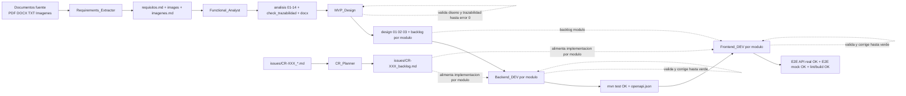

# Workflow MVP - Agentes y Skills

## 1. Alcance de esta documentacion

Este documento consolida el flujo de trabajo de los 6 agentes en `.github/agents` y detalla los skills que cada uno utiliza.

Agentes revisados:
- `.github/agents/Requirements_Extractor.agent.md`
- `.github/agents/Functional_Analyst.agent.md`
- `.github/agents/MVP_Design.agent.md`
- `.github/agents/Backend_DEV.agent.md`
- `.github/agents/Frontend_DEV.agent.md`
- `.github/agents/CR_Planner.md`

## 2. Mapa global de ejecucion

### 2.1 Flujo principal MVP (de requisitos a implementacion)

1. `Requirements_Extractor`  
   Entrada: documentos fuente (pdf/docx/txt/imagenes).  
   Salida: `requisitos.md` + carpeta `images/` + `imagenes.md`.

2. `Functional_Analyst`  
   Entrada: `requisitos.md`, `imagenes.md`.  
   Salida: carpeta `analisis/` con secciones 01-14 + `Analisis_Funcional.docx`.

3. `MVP_Design`  
   Entrada: artefactos `analisis/`.  
   Salida: `design/01_technical_design.md`, `design/02_data_model.md`, `design/03_data_services.md`, y `backlog/*.md` por modulo con validaciones.

4. `Backend_DEV` (por modulo backlog)  
   Entrada: `backlog/XX_modulo.md` (+ `design/02`, `design/03` opcional).  
   Salida: backend implementado + tests backend en verde + `openapi.json`.

5. `Frontend_DEV` (por modulo backlog)  
   Entrada: `backlog/XX_modulo.md` + `openapi.json` (+ analisis opcional).  
   Salida: frontend implementado + E2E en modo real/mock + `lint` y `build` verdes.

### 2.2 Flujo paralelo para cambios evolutivos (CR)

`CR_Planner` opera aparte del flujo MVP base:
- Entrada: `issues/CR-XXX_*.md`.
- Salida: `issues/CR-XXX_backlog.md` adaptado al repo existente.
- No implementa codigo: solo genera backlog tecnico atomico y trazable.

### 2.3 Diagrama Mermaid del pipeline global

### 2.4 Explicacion narrativa del diagrama

El pipeline principal comienza en los documentos fuente y los transforma en requisitos estructurados (`requisitos.md` e `imagenes.md`) con `Requirements_Extractor`.  
Con esos artefactos, `Functional_Analyst` genera el analisis funcional completo (`analisis/01-14`) y valida trazabilidad para asegurar cobertura antes de pasar a diseno.

`MVP_Design` usa el analisis para construir la base tecnica (`design/01`, `design/02`, `design/03`) y generar backlogs por modulo. En esta etapa hay ciclos de correccion internos hasta obtener validaciones sin errores (diseno y trazabilidad).

Desde los backlogs modulares se ejecuta la implementacion: primero `Backend_DEV` para dejar compilacion/tests en verde y publicar `openapi.json`; despues `Frontend_DEV`, que consume `openapi.json` y valida cada pantalla en doble modo (API real y mock), cerrando con `lint`, `build` y E2E globales en verde.

El flujo de CR es paralelo al MVP base: `CR_Planner` recibe un `CR-XXX`, genera `issues/CR-XXX_backlog.md` y ese backlog alimenta directamente las implementaciones de backend/frontend por modulo, sin rehacer las fases iniciales de extraccion y analisis completo.

## 3. Convenciones transversales detectadas

- En los agentes de diseno/implementacion existe una regla explicita: cada fase se ejecuta por subagente (`agent`), y el agente principal orquesta/valida.
- Hay validaciones iterativas obligatorias hasta error 0 en:
  - diseno (`validate_design.py`),
  - trazabilidad de backlog por modulo y consolidada (`valida_trazabilidad.py`),
  - pruebas backend/frontend (reintento hasta verde).
- Se fuerza escritura incremental en documentos extensos para evitar limites de salida.
- La trazabilidad RF/HU/CU/Pantalla/PF es un eje central de analisis, diseno y backlog.

## 4. Agente 1 - Requirements_Extractor

Archivo: `.github/agents/Requirements_Extractor.agent.md`

### 4.1 Objetivo

Extraer requisitos de documentos tecnicos y convertir imagenes en artefactos editables.

### 4.2 Flujo operativo

Fase 1 (subagente):
- Ejecuta skill `text-extractor` sobre documentos de entrada.
- Genera `requisitos.md` y carpeta `images/`.

Fase 2 (subagentes en paralelo):
- Si existe `images/`, lista imagenes y las divide en bloques de 5.
- Lanza un subagente por bloque.
- Bloque 1 crea `imagenes.md`; bloques posteriores hacen append.

### 4.3 Skills usados

#### `text-extractor`
- Archivo: `.github/skills/text-extractor/SKILL.md`
- Funcion: extraer RF, RB, DC, INT y contexto general.
- Comando canonico:
  - `python .\.github\skills\text-extractor\scripts\extractor_de_requisitos.py "[DOC1]" "[DOC2]" -o requisitos.md --tesseract-path "C:\T-AI-lormade\Tesseract-OCR\tesseract.exe" --include-context`
- Salidas:
  - `requisitos.md`
  - `images/` (imagenes extraidas).

#### `image-analyzer`
- Archivo: `.github/skills/image-analyzer/SKILL.md`
- Funcion: analizar visualmente imagenes y convertirlas a wireframe ASCII, Mermaid, tabla Markdown o transcripcion.
- Reglas criticas:
  - usar vision real (no inferir solo OCR),
  - maximo 5 imagenes por invocacion,
  - primer bloque crea archivo, siguientes agregan.
- Salida: `imagenes.md`.

## 5. Agente 2 - Functional_Analyst

Archivo: `.github/agents/Functional_Analyst.agent.md`

### 5.1 Objetivo

Generar analisis funcional completo (o modo prototipo) a partir de `requisitos.md` y `imagenes.md`.

### 5.2 Modos

- Completo: secciones 1-14.
- Prototipo: 1, 2, 3, 5, 10, 11, 14 (omite 4, 6, 7, 8, 9, 12, 13 segun skill/fase).

### 5.3 Flujo operativo (8 fases)

Inicializacion:
- crea `analisis/`,
- lee entradas,
- cuenta RF/RB/DC/INT/imagenes,
- registra en `analisis/debug.md`,
- define modo (completo/prototipo).

Fases:
1. Requisitos (`requirements-synthesizer`) -> `01`, `02`, `03`, `04` (04 omitida en prototipo).
2. Integraciones (`integrations-spec`) -> `08` (paralelo con Fase 3; omitida en prototipo).
3. HU/CU (`user-stories-generator`) -> `05`, `06` (06 omitida en prototipo).
4. UI y navegacion (`ui-prototyper`) -> `10`, `11`, `12` (12 omitida en prototipo).
5. Diagramas (`mermaid-diagrams`) -> `07`, `09` (omitida en prototipo).
6. Pruebas funcionales (`functional-testing`) -> `13` (omitida en prototipo).
7. Trazabilidad (`traceability-validator`) -> `14` + validacion script.
8. Consolidacion (`doc-assembler`) -> `analisis/Analisis_Funcional.docx`.

Validaciones criticas del flujo:
- HU/CU en relacion 1:1 estricta.
- Cobertura 100% de pantallas en wireframes (10 vs 12).
- Trazabilidad con `ERROR = 0` para finalizar.

### 5.4 Skills usados y detalle

#### `requirements-synthesizer`
- Archivo: `.github/skills/requirements-synthesizer/SKILL.md`
- Produce:
  - `analisis/01_objetivo_y_alcance.md`
  - `analisis/02_actores_y_roles.md`
  - `analisis/03_requerimientos_funcionales.md`
  - `analisis/04_requerimientos_tecnicos.md` (modo completo).
- Regla: sintetizar RF (no copiar literal), IDs RF consecutivos.

#### `integrations-spec`
- Archivo: `.github/skills/integrations-spec/SKILL.md`
- Produce: `analisis/08_integraciones.md`.
- Regla: una sola tabla, sin secciones narrativas extra.

#### `user-stories-generator`
- Archivo: `.github/skills/user-stories-generator/SKILL.md`
- Produce:
  - `analisis/05_historias_usuario.md`
  - `analisis/06_casos_uso.md` (modo completo).
- Regla critica: 1 HU = 1 CU (sin agrupaciones), conteo final igual.

#### `ui-prototyper`
- Archivo: `.github/skills/ui-prototyper/SKILL.md`
- Produce:
  - `analisis/10_interfaces_usuario.md`
  - `analisis/11_diagramas_navegacion.md`
  - `analisis/12_prototipos_interfaz.md` (modo completo).
- Regla critica: cada `P-XXX` de seccion 10 debe tener wireframe en seccion 12.

#### `mermaid-diagrams`
- Archivo: `.github/skills/mermaid-diagrams/SKILL.md`
- Produce:
  - `analisis/07_diagramas_procesos.md`
  - `analisis/09_diagramas_estados.md`.

#### `functional-testing`
- Archivo: `.github/skills/functional-testing/SKILL.md`
- Produce: `analisis/13_pruebas_funcionales.md`.
- Regla: cubrir flujo principal, alternativos, validaciones, permisos y limites.

#### `traceability-validator`
- Archivo: `.github/skills/traceability-validator/SKILL.md`
- Produce: `analisis/14_matriz_trazabilidad.md`.
- Valida con:
  - `python .\.github\skills\traceability-validator\scripts\valida_trazabilidad.py --out .\analisis\check_trazabilidad.md`
- Regla critica: repetir correccion/validacion hasta `Discrepancias (ERROR) = 0`.

#### `doc-assembler`
- Archivo: `.github/skills/doc-assembler/SKILL.md`
- Consolida markdown de `analisis/` en docx:
  - `python .\.github\skills\doc-assembler\scripts\md2docx.py analisis/ analisis/Analisis_Funcional.docx`

## 6. Agente 3 - MVP_Design

Archivo: `.github/agents/MVP_Design.agent.md`

### 6.1 Objetivo

Generar diseno tecnico, modelo de datos, especificacion de servicios y backlogs por modulo para MVP full-stack.

### 6.2 Prerrequisito

Requiere analisis funcional completo en `analisis/` (archivos 01 a 14).

### 6.3 Flujo operativo (6 fases)

1. Diseno tecnico (`technical-designer`) -> `design/01_technical_design.md`.
2. Modelo de datos (`data-modeler`) -> `design/02_data_model.md` (depende de 01).
3. Servicios (`services-designer`) -> `design/03_data_services.md` (depende de 01+02).
4. Validacion de diseno (subagente de validacion):
   - ejecuta `python .github/skills/technical-designer/scripts/validate_design.py`,
   - corrige y repite hasta 0 errores.
5. Backlog por modulo (`backlog-planner`) en secuencia segun orden del `design/01`:
   - genera `backlog/XX_[Modulo].md`,
   - valida por modulo:
     - `python .github/skills/traceability-validator/scripts/valida_trazabilidad.py --backlog backlog/XX_[Modulo].md --module-scope --out backlog/check_XX_[Modulo].md`
   - corrige/revalida hasta 0 errores.
6. Validacion final consolidada:
   - limpia reportes parciales: `Remove-Item backlog\check_*.md -ErrorAction SilentlyContinue`
   - valida conjunto completo:
     - `python .github/skills/traceability-validator/scripts/valida_trazabilidad.py --backlog-dir backlog --out backlog/check_final.md`
   - corrige backlog(s) y repite hasta 0 errores.

### 6.4 Skills usados y detalle

#### `technical-designer`
- Archivo: `.github/skills/technical-designer/SKILL.md`
- Salida: `design/01_technical_design.md` con 4 secciones fijas:
  - resumen ejecutivo,
  - arquitectura modular,
  - estructura de rutas (UI + API alto nivel),
  - dependencias entre modulos.
- Referencias estructurales:
  - `.github/skills/technical-designer/references/frontend-template-structure.md`
  - `.github/skills/technical-designer/references/backend-template-structure.md`

#### `data-modeler`
- Archivo: `.github/skills/data-modeler/SKILL.md`
- Salida: `design/02_data_model.md` con:
  - catalogo de entidades,
  - detalle por entidad,
  - diagrama ER,
  - matriz de relaciones,
  - resumen de enums.
- Regla: no duplicar valores de enums por entidad; consolidar en seccion de resumen.

#### `services-designer`
- Archivo: `.github/skills/services-designer/SKILL.md`
- Salida: `design/03_data_services.md`.
- Define contratos para modo dual frontend (mock/backend) y API REST backend.
- Incluye convenciones de errores, paginacion, filtros y ordenacion.

#### `backlog-planner`
- Archivo: `.github/skills/backlog-planner/SKILL.md`
- Salida: `backlog/XX_[Nombre_Modulo].md` por modulo.
- Reglas:
  - granularidad atomica por archivo/metodo/accion,
  - trazabilidad obligatoria por tarea,
  - orden backend->frontend,
  - sin tareas macro ni bloques narrativos.
- Plantilla obligatoria:
  - `.github/skills/backlog-planner/references/backlog-template.detallado.md`

#### `traceability-validator`
- Reutilizado para validar cobertura por modulo y consolidada.
- Criterio de salida del agente: `check_final.md` con 0 errores.

## 7. Agente 4 - Backend_DEV

Archivo: `.github/agents/Backend_DEV.agent.md`

### 7.1 Objetivo

Implementar todas las tareas backend de un modulo backlog y dejar:
- compilacion sin errores,
- tests backend en verde,
- `openapi.json` generado para frontend.

### 7.2 Flujo operativo

0. Inicializacion:
- extrae `moduleSlug`, `moduleKey`, `modulePackage` y lista de tareas backend desde backlog.

1. Implementacion por fases via `backend-code-generator`:
- migraciones Flyway,
- entities JPA,
- repositories,
- DTOs,
- services,
- controllers,
- tests backend (en el agente se delega a `backend-test-generator`).

2. Validacion build/test (subagente):
- `cd backend; mvn clean compile`
- `cd backend; mvn -Dtest="com/nttdata/backend/{modulePackage}/**/*Test,com/nttdata/backend/{modulePackage}/**/*IntegrationTest" test`
- `cd backend; mvn test`
- Si falla: corregir y repetir.

3. Export OpenAPI (subagente):
- arranca backend:
  - `cd backend; mvn -DskipTests spring-boot:run`
- prueba endpoints:
  - `http://localhost:8080/v3/api-docs`
  - `http://localhost:8080/api/v3/api-docs`
- guarda `openapi.json` en raiz,
- valida claves `openapi` y `paths`,
- detiene backend.

4. Entrega:
- marca tareas backend del backlog como completadas,
- reporta `mvn test` y estado de `openapi.json`.

### 7.3 Skills usados y detalle

#### `backend-code-generator`
- Archivo: `.github/skills/backend-code-generator/SKILL.md`
- Modos: `migrations`, `entities`, `repositories`, `dtos`, `services`, `controllers`, `all`.
- Fuente primaria: backlog del modulo.
- Aceleradores opcionales: `design/02` y `design/03`.
- Reglas criticas:
  - numeracion Flyway secuencial real segun carpeta de migraciones,
  - no editar migraciones ya ejecutadas,
  - controllers con `@RequestMapping("/[moduleSlug]")` sin duplicar `/api`,
  - contratos HTTP con `ApiResponse<T>`.

#### `backend-test-generator`
- Archivo: `.github/skills/backend-test-generator/SKILL.md`
- Modos: `unit`, `controller`, `security`, `integration`, `all`.
- Estrategia por capas:
  - unit service con Mockito,
  - controller contract con MockMvc + `PostgresTestContainer`,
  - security 401/403 con `@SpringBootTest`,
  - integration con Testcontainers + Flyway.
- Regla critica de context path:
  - si existe `/api`, usar ruta externa con prefijo y `.contextPath("/api")`.

## 8. Agente 5 - Frontend_DEV

Archivo: `.github/agents/Frontend_DEV.agent.md`

### 8.1 Objetivo

Implementar todas las tareas frontend de un modulo backlog con validacion E2E en doble modo (API real y mock), mas `lint`/`build`.

### 8.2 Flujo operativo

Pre-flight (obligatorio):
- verifica `openapi.json`,
- deriva `moduleSlug`,
- detecta base URL real segun context-path backend,
- confirma readiness de frontend.

Fases:
1. Tipos (`frontend-code-generator`, modo `types`).
2. Servicios mock+api (`frontend-code-generator`, modo `services`) alineados a `openapi.json`.
3. Store (`frontend-code-generator`, modo `store`), con seleccion `SERVICE_MODE`.
4. Iteracion por pantalla:
   - UI (`ui-builder`),
   - rutas+sidebar (subagente dedicado),
   - test E2E pantalla (`e2e-testing`),
   - ejecucion E2E API real,
   - ejecucion E2E mock,
   - avanzar solo cuando ambos modos quedan en verde.
5. Validacion final modulo:
   - E2E de todo el modulo en API real,
   - E2E de todo el modulo en mock.
6. Quality gate frontend:
   - `npm run lint`
   - `npm run build`
   - corrida total E2E con `VITE_USE_MOCK=false` y luego `true`.
7. Entrega:
   - reporta PASSED API/MOCK, lint OK, build OK,
   - marca checkboxes frontend en backlog.

### 8.3 Comandos clave del flujo

- API real por pantalla/modulo:
  - `cd frontend; $env:VITE_USE_MOCK="false"; $env:VITE_API_BASE_URL="{VITE_API_BASE_URL}"; npx playwright test src/tests/e2e/{moduleSlug}/... --reporter=list`
- Mock por pantalla/modulo:
  - `cd frontend; $env:VITE_USE_MOCK="true"; npx playwright test src/tests/e2e/{moduleSlug}/... --reporter=list`
- Suite completa:
  - `cd frontend; $env:VITE_USE_MOCK="false"; npm run test:e2e --reporter=list`
  - `cd frontend; $env:VITE_USE_MOCK="true"; npm run test:e2e --reporter=list`

### 8.4 Skills usados y detalle

#### `frontend-code-generator`
- Archivo: `.github/skills/frontend-code-generator/SKILL.md`
- Modos: `types`, `services`, `store`, `all`.
- Fuente primaria: backlog modulo.
- Patron obligatorio de servicios:
  - `*ServiceMock.ts` y `*Service.ts`,
  - selector en store por `SERVICE_MODE` desde `frontend/src/shared/utils/serviceMode.ts`.
- Mock con latencia base 500 ms y dataset minimo configurable.

#### `ui-builder`
- Archivo: `.github/skills/ui-builder/SKILL.md`
- Construye paginas/componentes React usando templates cuando aplica:
  - `ListPageTemplate`,
  - `DetailPageTemplate`,
  - `FormPageTemplate`.
- Usa componentes compartidos de `frontend/src/shared/components/`.
- Reglas:
  - usar alias `@/`,
  - no duplicar shared components,
  - no usar `alert/confirm/prompt`.
- Convencion `data-testid` canonical:
  - `.github/skills/ui-builder/references/testids.md`.

#### `e2e-testing`
- Archivo: `.github/skills/e2e-testing/SKILL.md`
- Genera y ejecuta tests Playwright por criterio/pantalla.
- Regla critica:
  - preflight de render antes de correr tests,
  - si falta `data-testid` o mock data, se corrige inmediatamente.
- Shadcn Select:
  - no usar `selectOption()`,
  - usar click sobre trigger y luego opcion por `[role="option"]`.

## 9. Agente 6 - CR_Planner

Archivo: `.github/agents/CR_Planner.md`

### 9.1 Objetivo

Generar o actualizar backlog tecnico para un Change Request (`issues/CR-XXX_backlog.md`) adaptado al codigo real existente.

Restriccion principal:
- No implementar codigo backend/frontend.
- No tocar artefactos funcionales.
- Solo discovery + backlog.

### 9.2 Flujo operativo

1. Discovery:
- lee CR de entrada,
- lee skill y plantilla de backlog-planner,
- extrae alcance (entidades, operaciones, roles, pantallas),
- normaliza `crId`, `moduleSlug`, `moduleKey`, `modulePackage`,
- lanza subagentes de mapeo de repo:
  - Backend map (A),
  - Frontend map (B),
  - Tests map (C, opcional recomendado).

2. Alignment:
- si hay ambiguedad, usa `vscode/askQuestions` para confirmar.

3. Design:
- genera backlog siguiendo la plantilla detallada,
- adapta tareas a archivos reales del repo (reutilizar si ya existe).

4. Refinement (quality gates):
- todo en `- [ ]`,
- toda tarea con `Ref:`,
- sin tareas macro ni narrativas por tarea,
- no inventar paths/packages (si no verificado: "por confirmar").

### 9.3 Trazabilidad para CR

- Si CR no trae IDs de analisis funcional, usar `Ref: (CR-XXX)` en todas las tareas.
- Si trae RF/HU/CU/PF/Pantalla, mantener `Ref: (CR-XXX)` y anadir IDs encontrados.

### 9.4 Skills usados y detalle

#### `backlog-planner`
- Archivo: `.github/skills/backlog-planner/SKILL.md`
- Reutiliza mismo formato granular del MVP.
- Plantilla obligatoria:
  - `.github/skills/backlog-planner/references/backlog-template.detallado.md`
- Adapta tareas a realidad del repo existente (no crear desde cero sin validar).

#### `traceability-validator` (opcional)
- Se puede ejecutar para CR cuando existan referencias funcionales:
  - `python .github/skills/traceability-validator/scripts/valida_trazabilidad.py --backlog issues/CR-XXX_backlog.md --module-scope --out issues/check_CR-XXX_backlog.md`

## 10. Matriz de skills por agente

| Agente | Skills principales |
|---|---|
| Requirements_Extractor | text-extractor, image-analyzer |
| Functional_Analyst | requirements-synthesizer, integrations-spec, user-stories-generator, ui-prototyper, mermaid-diagrams, functional-testing, traceability-validator, doc-assembler |
| MVP_Design | technical-designer, data-modeler, services-designer, backlog-planner, traceability-validator |
| Backend_DEV | backend-code-generator, backend-test-generator |
| Frontend_DEV | frontend-code-generator, ui-builder, e2e-testing |
| CR_Planner | backlog-planner (+ traceability-validator opcional) |

## 11. Artefactos clave generados en todo el pipeline

- Extraccion:
  - `requisitos.md`
  - `imagenes.md`
  - `images/`
- Analisis:
  - `analisis/01_*.md` ... `analisis/14_*.md`
  - `analisis/check_trazabilidad.md`
  - `analisis/Analisis_Funcional.docx`
- Diseno:
  - `design/01_technical_design.md`
  - `design/02_data_model.md`
  - `design/03_data_services.md`
- Backlogs:
  - `backlog/XX_[Modulo].md`
  - `backlog/check_XX_[Modulo].md`
  - `backlog/check_final.md`
  - `issues/CR-XXX_backlog.md` (flujo CR)
- Implementacion:
  - backend modulo + tests backend
  - frontend modulo + tests E2E
  - `openapi.json`

## 12. Conclusiones operativas

- El flujo esta pensado como pipeline trazable y validado por gates iterativos (error 0).
- `backlog-planner` y `traceability-validator` son ejes de control de cobertura en diseno y CR.
- En implementacion, el contrato entre backend y frontend se formaliza via `openapi.json` y pruebas E2E en doble modo (real/mock).
